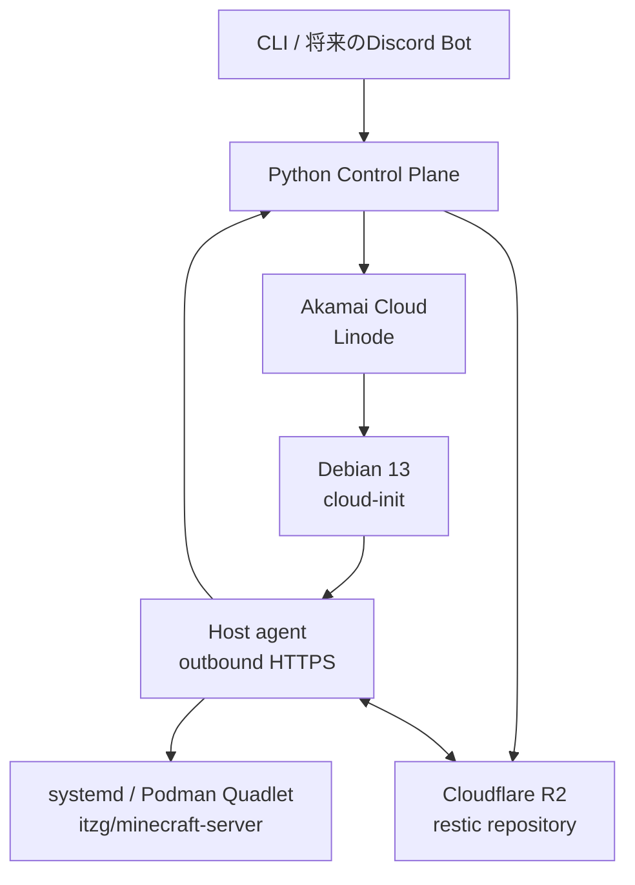

# mc-control-plane

小規模なコミュニティ向けMinecraftマルチプレイサーバーのライフサイクルを自動化するControl Planeです。

常時稼働するControl Planeから、必要なときだけAkamai Cloud上にLinodeを作成します。
Cloudflare R2に保存したServer Unitを復元してPaperMCを実行し、停止時には
restic snapshotをR2へ保存してからLinodeを削除します。



## 確定している方針

- 稼働中の最新データはroot diskにあり、確定済みの永続的な復旧点はR2上のrestic snapshotとする。
- 実行用データにはLinodeのroot diskを使い、Block Storage Volumeは使わない。
- Control Planeが自動作成・削除するAkamai CloudリソースはLinodeだけとする。
- Paper、plugin、Minecraft設定の内容は管理しない。Server Unitに関連する不透明なpayloadとして保存・復元する。
- 同じServer Unitを同時に複数のLinodeで起動しない。
- CLIを最初の操作インターフェイスとし、Discord Botなどは後から同じapplication use caseへ接続する。
- Execution HostはDebian 13とし、container lifecycleをsystemd / Podman Quadletで管理する。
- 通常のHost制御にはoutbound polling agentを使い、SSHは手動調査専用とする。
- Execution HostはLinode Interfacesだけを使い、一時root diskのlocal disk encryptionを無効にする。
- restic repositoryは空passwordで運用し、R2 credential以外の復元secretを持たない。
- 商用サービス級の高可用性は目標にしない。明示snapshotと単純で回復可能な処理を優先する。

## ドキュメント

- [Documentation index](docs/README.md)
- [Architecture](docs/architecture.md)
- [中期目標: Operational MVP](docs/operational-mvp.md)
- [Project structure](docs/project-structure.md)
- [State machines](docs/state-machines.md)

## 現在の段階

Gate 1から5までの実装、自動test、実account live acceptanceが完了しています。Linode ownership、
Debian 13 Host、永続start、R2/restic、Paper start、quiesced manual snapshot、graceful stop、
停止後snapshot、fresh Host restore/restart、最終cleanupを順に実証しました。

現在の通常`server-unit-start`はHost readyまでを永続workflowとして扱います。restore、Minecraft
start、manual snapshot、stop、Linode削除のprimitiveはGate 5 harnessで検証済みですが、通常運用の
個別OperationとCLIにはまだ接続していません。次の境界は、このproduct workflow化です。

後方互換性はまだ要求せず、実装と実環境検証から得た知見に基づく破壊的変更を許容します。

## Development

```bash
uv sync
uv run ruff check .
uv run ruff format --check .
uv run mypy src host_agent/src
uv run pytest
uv build
uv build --project host_agent --out-dir dist/host-agent
```

SQLite databaseを初期化するには次を実行します。

```bash
uv run mc-control-plane init-db ./control-plane.db
```

課金を伴うGate 1の実account検証は、通常の開発testから分離しています。実行前に
[Gate 1 acceptance](docs/gates/01-infra-lifecycle.md)を確認してください。
Debian HostとQuadletを検証するGate 2は[Gate 2 acceptance](docs/gates/02-host-foundation.md)を
確認してください。
永続workflowとprocess再開を検証するGate 3は
[Gate 3 acceptance](docs/gates/03-durable-orchestration.md)を確認してください。
restic/R2とfresh Host restoreを検証するGate 4は
[Gate 4 acceptance](docs/gates/04-data-lifecycle.md)を確認してください。
Paperのstart、snapshot、stop、fresh Host restore/restartを検証するGate 5は
[Gate 5 acceptance](docs/gates/05-minecraft-lifecycle.md)を確認してください。
