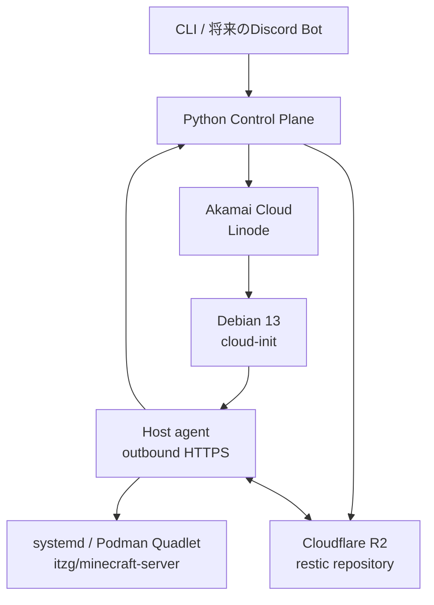

# mc-control-plane

小規模なコミュニティ向けMinecraftマルチプレイサーバーのライフサイクルを自動化するControl Planeです。

常時稼働するControl Planeから、必要なときだけAkamai Cloud上にLinodeを作成します。
Cloudflare R2に保存したServer Unitを復元してPaperMCを実行し、停止時には
restic snapshotをR2へ保存してからLinodeを削除します。



## 確定している方針

- 稼働中の最新データはroot diskにあり、確定済みの永続的な復旧点はR2上のrestic snapshotとする。
- 実行用データにはLinodeのroot diskを使い、Block Storage Volumeは使わない。
- Control Planeが自動作成・削除するAkamai CloudリソースはLinodeだけとする。
- Paper、plugin、Minecraft設定の内容は管理しない。Server Unitに関連する不透明なpayloadとして保存・復元する。
- 同じServer Unitを同時に複数のLinodeで起動しない。
- CLIを最初の操作インターフェイスとし、Discord Botなどは後から同じapplication use caseへ接続する。
- Execution HostはDebian 13とし、container lifecycleをsystemd / Podman Quadletで管理する。
- 通常のHost制御にはoutbound polling agentを使い、SSHは手動調査専用とする。
- Execution HostはLinode Interfacesだけを使い、一時root diskのlocal disk encryptionを無効にする。
- 商用サービス級の高可用性は目標にしない。定期snapshotと単純で回復可能な処理を優先する。

## ドキュメント

- [Architecture](docs/architecture.md)
- [中期目標: Operational MVP](docs/operational-mvp.md)
- [Gate 1: Infra lifecycle acceptance](docs/gates/01-infra-lifecycle.md)
- [Project structure](docs/project-structure.md)
- [State machines](docs/state-machines.md)
- [ADR-0001: resticをバックアップエンジンに採用する](docs/decisions/0001-use-restic.md)
- [ADR-0002: Block Storage Volumeを使用しない](docs/decisions/0002-no-block-storage-volume.md)
- [ADR-0003: 信頼性と可用性の目標](docs/decisions/0003-reliability-scope.md)
- [ADR-0004: Control Plane databaseにSQLiteを使用する](docs/decisions/0004-use-sqlite.md)
- [ADR-0005: 永続化されたOperationを同期的に一stepずつ処理する](docs/decisions/0005-use-stepwise-reconciler.md)
- [ADR-0006: 公式Linode SDKをCompute adapter内に隔離して使用する](docs/decisions/0006-use-official-linode-sdk.md)
- [ADR-0007: Debian 13上のcontainer lifecycleにPodman Quadletを使用する](docs/decisions/0007-use-quadlet-on-debian-13.md)
- [ADR-0008: 通常のHost制御にoutbound polling Host agentを使用する](docs/decisions/0008-use-outbound-host-agent.md)
- [ADR-0009: 一時Linodeのlocal disk encryptionを無効にする](docs/decisions/0009-disable-local-disk-encryption.md)

## 現在の段階

最初のproject骨格、domain model、SQLite persistence、start workflowのCompute確保部分、
公式SDKを使うAkamai Cloud Compute adapterとGate 1 harnessまで実装しています。adapterは
Debian 13/Metadata/Firewallのpreflight、cloud-init Metadata、所有tagによる検索、作成、状態観測、
所有権限定の削除を実装済みです。credential-free testは完了し、実accountの明示的なlive
acceptanceとHost制御は未実施です。
中期的には、Infra lifecycleとDebian 13 Host foundationをMinecraftより先に完成させ、
その上で一つのServer Unitのstart、snapshot、stop、再restoreを一周させます。
後方互換性はまだ要求せず、実装から得た知見に基づく破壊的変更を許容します。

## Development

```bash
uv sync
uv run ruff check .
uv run ruff format --check .
uv run mypy src
uv run pytest
uv build
```

SQLite databaseを初期化するには次を実行します。

```bash
uv run mc-control-plane init-db ./control-plane.db
```

課金を伴うGate 1の実account検証は、通常の開発testから分離しています。実行前に
[Gate 1 acceptance](docs/gates/01-infra-lifecycle.md)を確認してください。
