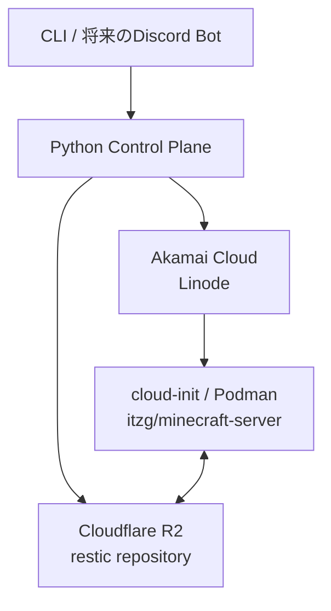

# mc-control-plane

小規模なコミュニティ向けMinecraftマルチプレイサーバーのライフサイクルを自動化するControl Planeです。

常時稼働するControl Planeから、必要なときだけAkamai Cloud上にLinodeを作成します。
Cloudflare R2に保存したServer Unitを復元してPaperMCを実行し、停止時には
restic snapshotをR2へ保存してからLinodeを削除します。

## 確定している方針

- 稼働中の最新データはroot diskにあり、確定済みの永続的な復旧点はR2上のrestic snapshotとする。
- 実行用データにはLinodeのroot diskを使い、Block Storage Volumeは使わない。
- Control Planeが自動作成・削除するAkamai CloudリソースはLinodeだけとする。
- Paper、plugin、Minecraft設定の内容は管理しない。Server Unitに関連する不透明なpayloadとして保存・復元する。
- 同じServer Unitを同時に複数のLinodeで起動しない。
- CLIを最初の操作インターフェイスとし、Discord Botなどは後から同じapplication use caseへ接続する。
- 商用サービス級の高可用性は目標にしない。定期snapshotと単純で回復可能な処理を優先する。

## ドキュメント

- [Architecture](docs/architecture.md)
- [Project structure](docs/project-structure.md)
- [State machines](docs/state-machines.md)
- [ADR-0001: resticをバックアップエンジンに採用する](docs/decisions/0001-use-restic.md)
- [ADR-0002: Block Storage Volumeを使用しない](docs/decisions/0002-no-block-storage-volume.md)
- [ADR-0003: 信頼性と可用性の目標](docs/decisions/0003-reliability-scope.md)

## 現在の段階

設計初期段階です。後方互換性はまだ要求せず、実装から得た知見に基づく破壊的変更を許容します。
