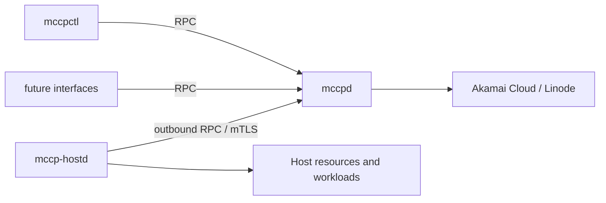

# mc-control-plane

Minecraft server automationのためのControl Planeを、Rustで新しく設計・実装するprojectです。

現在は実装開始前のfoundation設計段階です。既存のPython実装を互換対象として移植するのではなく、
実装と実環境検証から得られた知見を参考にしながら、概念、責務、protocol、failure modelを整理し直します。

## 目標とする構成

- `mccpd`: state、controller、provider integration、identityを所有する単一のRust daemon
- `mccp-hostd`: 各Hostに常駐し、Hostを観測・制御するRust daemon
- `mccpctl`: `mccpd`だけを操作するRPC client
- 将来のDiscord BotやWeb interfaceも、同じRPC APIを利用するclient

## 現在のcheckpoint

中期checkpointは、Minecraft workloadを載せる前に、Hostを一つの独立したresource layerとして
完全に管理できる状態を作ることです。

- 上位layerが`HostClaim`を提示できる
- Host subsystemが必要なHostを確保する
- `mccp-hostd`が安全にenrollし、mTLSで`mccpd`と通信する
- Hostのidentity、provider resource、allocation、observed stateを一貫して管理する
- Claim解放後にHostをidleで保持し、policyに従って再利用または削除する
- process restartや通信断から安全に再開する
- 通常操作にSSHやprovider consoleを必要としない

詳細は[Host control checkpoint](docs/plans/checkpoint-host-control.md)を参照してください。

## Documentation

設計文書の入口は[docs/README.md](docs/README.md)です。

## Python prototype

以前のPython実装は作業ツリーから削除しました。履歴はGitに残っており、
`python-prototype-reference-2026-07-23` tagから参照できます。

旧実装は互換対象ではありません。引き継ぐ知見は
[Python prototypeから得た知見](docs/history/python-prototype.md)に整理しています。

## Development status

現在のbranchにはRust実装をまだ追加していません。次の段階でCargo workspaceと最小のdaemon/clientを作成します。
Rust toolchainの選定、build、format、lint、testの実行結果は実装開始後に文書化します。
