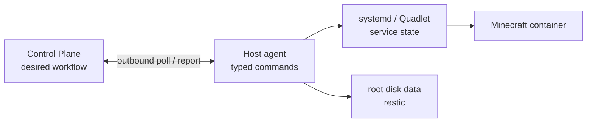
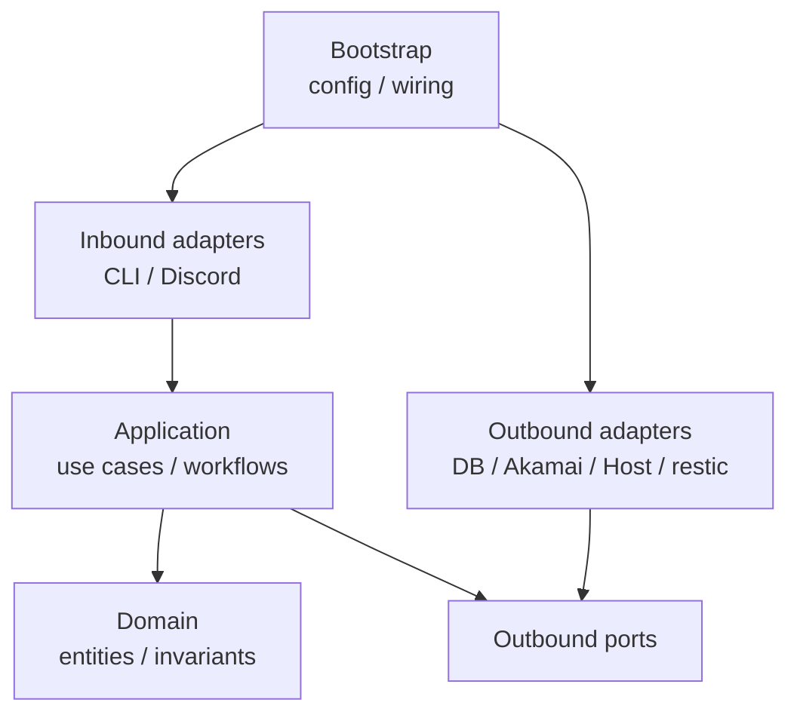

# Architecture

## 1. 目的

このシステムの目的は、Minecraftを遊ぶ人がインフラストラクチャやterminal操作へ時間を取られず、サーバーを安全かつ簡単に起動・停止できるようにすることです。

このシステムはMinecraft設定管理ツールではありません。
`ServerUnit`はMinecraftサーバーの論理的な識別単位であり、world、設定、pluginなどの
ファイル群はその不透明なpayloadとして一時的な実行環境へ展開・回収します。

## 2. 実行時のシステム境界

| 境界 | 管理するもの | 管理しないもの |
| --- | --- | --- |
| Interface | CLI、将来のDiscord Bot | UI固有のビジネスロジック |
| Control Plane | intent、Run、Operation、排他、観測履歴 | Minecraft payloadの内容 |
| Akamai Cloud adapter | Linodeの作成・観測・削除 | Firewallなど手動作成するresource、Volume |
| Execution Host | Debian 13 bootstrap、Host agent、Quadlet、restic、workload制御 | 汎用的な構成管理 |
| Minecraft Workload | container lifecycle、readiness、quiesce | Paper/plugin設定の編集 |
| Snapshot storage | restic snapshot、restore、retention | 独自のbackup formatや暗号化実装 |

Akamai Cloud、Cloudflare R2、手動作成したFirewallなどは外部システムです。
一時的なLinode上のbootstrap処理とhost control componentはこのプロジェクトの管理対象ですが、
OSやPodmanそのものを再実装しません。

Host agentはControl Planeへoutbound HTTPSでpollし、固定schemaの高水準commandだけを実行します。
Control Planeから一時Linodeへの通常のSSH接続や、任意shell実行はsystem boundaryに含めません。

## 3. コード上の依存境界

矢印はコードの依存方向です。ApplicationはAkamai Cloud SDKやrestic commandを直接参照せず、
自分が定義するportだけを参照します。Outbound adapterがportを実装し、bootstrapが実体を組み立てます。
Domainはframework、DB、network、subprocessへ依存しません。

## 4. データの正本

全レイヤーに共通する一つの正本は存在しません。情報ごとに所有者を決めます。

| 情報 | 正本・所有者 |
| --- | --- |
| desired state、Run、Operation、関連ID | Control Plane database |
| Linodeの実在とprovider status | Akamai Cloud API |
| Host agent、systemd、Minecraftの現在状態 | Hostからの認証済み観測結果 |
| 稼働中の最新Minecraft payload | active Runのroot disk |
| 確定済みの永続的な復旧点 | R2上のrestic snapshot |
| 利用者向けの総合状態 | 上記から導出するprojection。正本ではない |

したがって、R2を「常に最新のデータ」とはみなしません。Runの実行中はroot diskが先行し、
snapshotがcommitされた時点で、そのsnapshotが新しい永続的な復旧点になります。

## 5. ドメイン概念

### ServerUnit

独立して起動・停止・復元できるMinecraftサーバーの論理的なidentityです。
`server_unit_id`、表示名、desired state、使用する`RuntimeSpec`などを持ちます。
world、Paper設定、plugin、pluginデータはServer Unitに関連するpayloadですが、
Control Planeのdomain modelは個々のファイルの意味を解釈しません。

### RuntimeSpec

Server Unitを実行するための不変なvalue objectです。region、Linode type、OS image、
container image、手動作成済みresourceの参照など、Control Planeが必要とする実行条件を表します。
Minecraft内部設定は含めません。Runの開始時にeffective specを記録し、実行途中の設定変更が
既存Runへ暗黙に影響しないようにします。

### Run

一つのServer Unitを一つのLinodeで実行する試行です。固有の`run_id`、開始時の
`RuntimeSpec`、復元元snapshot ID、開始・終了時刻を持ちます。
途中のstepやretry状態はRunへ詰め込まず、`Operation`で追跡します。

### RuntimeInstance

Runのために確保したprovider resourceを表します。provider resource ID、region、作成時tag、
最後に観測したraw provider statusと観測時刻を保持します。
これはLinode SDK objectそのものではなく、domain/applicationが必要とする最小限の記録です。

### Snapshot

resticが作成し、commitまで確認できた復元可能な時点です。restic snapshot ID、対象Server Unit、
作成元Run、種別、作成日時を記録します。`verified_at`は作成時には空で、別のfresh Hostへrestoreして
内容digestが一致した時点だけを記録します。作成途中や失敗した試行はSnapshotではなく、`Operation`
として記録します。

### Operation

start、stop、snapshot、maintenanceなどの長時間workflowです。操作種別、現在のstep、
retry時刻、状態、最後のerrorを永続化します。Control Planeが再起動しても、観測し直して
最後に確定したstepから進められる単位です。

### HostCommand

Control Planeが一つのRunとOperation stepに対して発行する、Host agent向けの冪等なcommandです。
固有のcommand ID、payload schema version、deadlineを持ちます。これは長期的なdomain entityではなく、
Control PlaneのOperationとHost agentのlocal journalを結ぶprotocol上の概念です。任意shellではなく、
restore、snapshot、Quadlet適用、workload start/stopなどの固定語彙だけを持ちます。

### Active Run invariant

一つのServer Unitにactive Runが最大一つであることは、独立した`Lease` entityではなく、
transactional database constraintとして表現します。単一Control PlaneではTTL、renewal、
期限切れを伴うLeaseを導入しません。将来複数workerが必要になった場合だけ再検討します。

## 6. 不変条件とresource所有権

- 一つのServer Unitにactive Runは最大一つとする。ここでactiveとは表示上の`running`ではなく、
  `ended_at`が未設定で、作成・起動・停止途中も含むRunを指す。
- 一つのServer Unitに対する未完了の変更系Operationは同時に一つだけとする。
- Runには同時に最大一つの未削除Runtime Instanceだけを関連付ける。
- 作成するLinodeへsystem、Server Unit、Runを識別できる決定論的な短い所有tagを付ける。
  元IDはDBへ保持し、providerのtag長制約に合わせたdigestをtag値に使う。
- 削除前にDB上のresource IDと所有tagを照合し、このシステムが所有しないLinodeを削除しない。
- createのtimeout後やControl Plane再起動後は、tagで既存Linodeを検索してから再作成する。
- 同じServer Unitに未知の既存Linodeが見つかった場合は、新規作成せず`blocked`にする。
- stop後のsnapshotがcommitされるまで、そのRunのLinodeを意図的に削除しない。
- snapshot、restore、forget/pruneは同じrestic repositoryに対して競合実行しない。
- Host commandはat-least-onceで配送されるものとし、同じcommand IDを二重適用しない。
- Host agentが報告したrun/resource identityがControl Planeのactive Runと一致しない場合はcommandを渡さない。
- Execution Hostの管理面はroot system serviceに限定し、Minecraft processとdataはlogin不能な固定
  UID/GID 1000へ分離する。Quadletがcontainerを最初からこのidentityで起動し、container内の
  UID/GID変更、`gosu`、暗黙のrecursive chownを経由しない。ownership不一致は起動前に拒否する。

これらは低確率障害向けの高可用性機能ではなく、通常の再実行や操作競合でデータを分裂させないための
最低限の安全条件です。

## 7. 状態モデル

全体を一つの`status`へ押し込みません。次の値を独立して保存します。

| 状態 | 所有者 | 例 |
| --- | --- | --- |
| Desired state | Control Plane | `running`, `stopped` |
| Operation state | Control Plane | `pending`, `running`, `retry_wait`, `blocked`, `succeeded`, `cancelled` |
| Provider state | Akamai Cloud | Linode APIの`status`文字列 |
| Observation state | Control Plane | 最終観測時刻、観測エラー、取得できたか |
| Host state | Host protocol | connectivity、bootstrap/readiness、agent/protocol version、最終heartbeat |
| Workload state | Minecraft adapter | `absent`, `starting`, `ready`, `stopping`, `stopped`, `failed` |
| Data state | Snapshot workflow | `empty`, `restoring`, `clean`, `dirty`, `snapshotting` |

利用者向けの`starting`や`running`は、これらの状態から導出する表示値です。
詳細は[State machines](state-machines.md)を参照してください。

## 8. データフロー

### Start

1. Server Unitのactive Runがないことをtransaction内で確認する。
2. `run_id`を発行し、effective `RuntimeSpec`と復元元snapshot IDを記録する。
3. 同じServer Unitを示す既存Linodeがないか、所有tagで確認する。
4. `run_id`と`server_unit_id`をtagに含めてLinodeを作成する。
5. provider resource IDを`RuntimeInstance`として記録する。
6. Linode APIの状態と、outbound agentのenrollment・Host準備完了をそれぞれ待つ。
7. agentへ指定されたrestic snapshot IDのrestoreを指示する。初回は空のpayloadを用意する。
8. agentが検証済みQuadletを適用し、生成されたsystemd serviceを起動してreadinessを確認する。
9. Runをactiveとして公開する。

### Stop

1. 新しい操作を受け付けない状態へ移行する。
2. Minecraft containerを正常停止する。
3. root disk上のServer Unitからrestic snapshotを作成する。
4. resticの成功終了とsnapshot IDを記録する。
5. Linodeを削除する。
6. 削除をAPIで確認し、active Runを終了する。

Snapshot作成に失敗した場合はLinodeを削除しません。商用サービス級の自動復旧は行わず、限定回数の再試行後に`blocked`として人間が確認できる状態へ移します。

## 9. Snapshot方針

- バックアップエンジンはresticとする。
- R2 bucket内ではServer Unitごとにrepositoryまたはprefixを分離する。
- repositoryは空passwordで初期化し、すべてのrestic repository commandへ
  `--insecure-no-password`を明示する。別管理のrepository secretは持たない。
- restore対象は`latest`ではなく、Control Planeが記録したsnapshot IDで指定する。
- Linodeのhostnameは実行ごとに変わるため、Server Unit専用repository内ではresticのhost識別子を
  固定値にする。
- 正常停止時のsnapshotを必須とする。
- 実行中の手動snapshotはRCON flushとcontainer pauseで静止させ、成否にかかわらずresumeする。
- 定期snapshotは実行間隔、失敗表示、retentionとの関係を決めてから同じ手動snapshot primitiveへ
  接続する。Gate 5の完成条件には含めない。
- retentionと`forget`/`prune`は停止処理から分離したControl Planeのmaintenance operationとする。
- 以前のsnapshotを一定期間残し、一つの新規snapshotだけに依存しない。具体的な保持数・期間は設定スキーマ設計時に決める。

## 10. Secret方針

- Akamai Cloud API tokenとR2親credentialはControl Planeだけが保持する。
- cloud-init user dataへ置くsecretは、一つのRun/resourceへbindした一回限り・短命のHost enrollment
  tokenだけとする。再利用可能なsecretは置かない。
- enrollment後はRun専用credentialを使い、Host agentはControl Planeへoutbound HTTPSで接続する。
- restore/snapshotの実行時だけ、Server Unitのprefixと必要operationへ限定した短命なR2 credentialを
  authenticated agent channelで渡す。
- data credentialをcloud-init、ログ、Quadlet、agent journal、DBの通常カラムへ平文で残さない。
- restic repository passwordは使用しない。R2へのaccess-controlはprefix、permission、TTLへ限定した
  temporary credentialで行う。

restic repository formatは空passwordでも内部データを暗号化・認証する。これは無効化できないformat上の
性質であり、機密性の境界としては扱わない。R2 credentialを取得した主体はrepositoryを読める前提とする。

Cloudflare R2は一つのbucket、操作、prefix、TTLへ制限したtemporary credentialを発行でき、resticは`AWS_SESSION_TOKEN`を利用できます。

## 11. 非目標

- Control Planeのactive-active構成
- 複数regionへの自動failover
- rareなprovider storage障害から最新データを完全に保護すること
- Block Storage Volumeの作成・attach・mount・detach
- Kubernetesの導入
- 通常workflowでのSSH remote execution
- Paper、plugin、world生成設定の編集
- バックアップアルゴリズムの自作
- restic以外のエンジンとの比較基盤

## 12. 実装方針

Infrastructure adapterから単独で作り始めません。先にdomain、application workflow、portを定義し、
fake adapterで不変条件と再実行をtestします。その後、最初の外部adapterとしてAkamai Cloudを
狭いvertical sliceで接続します。

project構成と具体的な実装順序は[Project structure](project-structure.md)を参照してください。
中期的な完成条件は[Operational MVP](operational-mvp.md)を参照してください。

## 参考資料

- [Linode API v4](https://techdocs.akamai.com/linode-api/reference/api)
- [linode_api4-python](https://github.com/linode/linode_api4-python)
- [Linode API OpenAPI specification](https://github.com/linode/linode-api-openapi)
- [restic documentation](https://restic.readthedocs.io/en/stable/)
- [Cloudflare R2 temporary credentials](https://developers.cloudflare.com/api/resources/r2/subresources/temporary_credentials/methods/create/)
- [itzg/minecraft-server](https://github.com/itzg/docker-minecraft-server)
- [Podman Quadlet](https://docs.podman.io/en/latest/markdown/podman-systemd.unit.5.html)
- [Akamai Cloud Metadata service](https://techdocs.akamai.com/cloud-computing/docs/overview-of-the-metadata-service)
