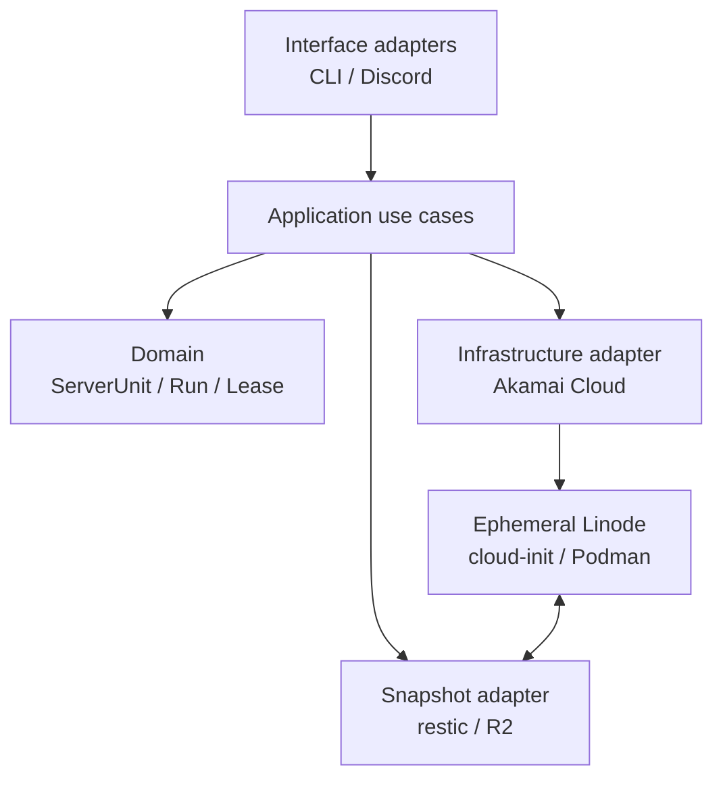

# Architecture

## 1. 目的

このシステムの目的は、Minecraftを遊ぶ人がインフラストラクチャやterminal操作へ時間を取られず、サーバーを安全かつ簡単に起動・停止できるようにすることです。

このシステムはMinecraft設定管理ツールではありません。Minecraftサーバーディレクトリ全体を`ServerUnit`という不透明なデータ単位として扱い、それを一時的な実行環境へ展開・回収します。

## 2. システム境界

| レイヤー | 管理するもの | 管理しないもの |
| --- | --- | --- |
| Interface | CLI、将来のDiscord Bot | UI固有のビジネスロジック |
| Control Plane | desired state、Run、排他、処理履歴 | Minecraft設定の意味 |
| Akamai Cloud | Linodeの作成・観測・削除 | Firewallなど事前作成するリソース、Volume |
| Host | cloud-init、Podman、必要な実行ツール | 汎用的な構成管理システム |
| Workload | containerの起動・停止・readiness | Paper/pluginの設定編集 |
| Persistence | resticによるsnapshot、restore、retention | 独自の重複排除・暗号化実装 |

## 3. コンポーネント

依存関係は外側から内側へ向けます。Akamai Cloud SDK、restic subprocess、CLI frameworkの詳細をdomainへ持ち込みません。

## 4. ドメイン概念

### ServerUnit

独立して起動・停止・復元できるMinecraftサーバーの論理単位です。
world、Paper設定、plugin、pluginデータなどをまとめて含みます。
Control Planeは内部ファイルの意味を解釈しません。

### Run

一つの`ServerUnit`を一つのLinodeで実行する試行です。再起動や再試行を含む処理の追跡単位で、固有の`run_id`を持ちます。

### Snapshot

resticが作成した復元可能な時点です。Control Planeはrestic snapshot ID、対象Server Unit、作成元Run、作成日時、検証状態を記録します。

### Lease

一つのServer Unitにactive Runが最大一つであることを保証します。
MVPでは単一Control Planeとtransactional database constraintで実現し、
分散consensusは導入しません。

### Operation

start、stop、snapshotなどの長時間処理を記録します。外部APIやsubprocessの途中でControl Planeが再起動しても、最後に確定したstepから処理を再開するために使います。

## 5. 状態モデル

全体を一つの`status`へ押し込みません。次の値を独立して保存します。

| 状態 | 所有者 | 例 |
| --- | --- | --- |
| Desired state | Control Plane | `running`, `stopped` |
| Operation state | Control Plane | `pending`, `running`, `retry_wait`, `blocked`, `succeeded`, `cancelled` |
| Provider state | Akamai Cloud | Linode APIの`status`文字列 |
| Observation state | Control Plane | 最終観測時刻、観測エラー、取得できたか |
| Host state | Host protocol | `unreachable`, `bootstrapping`, `ready`, `failed` |
| Workload state | Minecraft adapter | `absent`, `starting`, `ready`, `stopping`, `stopped`, `failed` |
| Data state | Snapshot workflow | `empty`, `restoring`, `clean`, `dirty`, `snapshotting` |

利用者向けの`starting`や`running`は、これらの状態から導出する表示値です。
詳細は[State machines](state-machines.md)を参照してください。

## 6. データフロー

### Start

1. Server Unitのactive Runがないことをtransaction内で確認する。
2. `run_id`を発行し、active Runを記録する。
3. `run_id`と`server_unit_id`をタグに含めてLinodeを作成する。
4. Linode APIの状態とHostの準備完了をそれぞれ待つ。
5. 指定されたrestic snapshot IDをroot diskへ復元する。初回は空のServer Unitを用意する。
6. `itzg/minecraft-server` containerを起動し、readinessを確認する。
7. Runをactiveとして公開する。

### Stop

1. 新しい操作を受け付けない状態へ移行する。
2. Minecraft containerを正常停止する。
3. root disk上のServer Unitからrestic snapshotを作成する。
4. resticの成功終了とsnapshot IDを記録する。
5. Linodeを削除する。
6. 削除をAPIで確認し、active Runを終了する。

Snapshot作成に失敗した場合はLinodeを削除しません。商用サービス級の自動復旧は行わず、限定回数の再試行後に`blocked`として人間が確認できる状態へ移します。

## 7. Snapshot方針

- バックアップエンジンはresticとする。
- R2 bucket内ではServer Unitごとにrepositoryまたはprefixを分離する。
- restore対象は`latest`ではなく、Control Planeが記録したsnapshot IDで指定する。
- Linodeのhostnameは実行ごとに変わるため、resticのhost識別子には安定したServer Unit IDを使う。
- 正常停止時のsnapshotを必須とする。
- 長時間稼働するRunでは定期snapshotを作成する。実行間隔とMinecraftデータを静止させる具体的な方法はhost/workload実装時に決める。
- 最初のstart/stop vertical sliceでは定期snapshotを後回しにできるが、無人運用を始める前には実装する。
- retentionと`forget`/`prune`は停止処理から分離したControl Planeのmaintenance operationとする。
- 以前のsnapshotを一定期間残し、一つの新規snapshotだけに依存しない。具体的な保持数・期間は設定スキーマ設計時に決める。

## 8. Secret方針

- Akamai Cloud API tokenとR2親credentialはControl Planeだけが保持する。
- LinodeにはServer Unitのprefixへ限定した短命なR2 credentialを渡す。
- secretをcloud-init user data、ログ、DBの通常カラムへ平文で残さない。
- repository passwordはR2 credentialと別のsecretとして管理する。

Cloudflare R2は一つのbucket、操作、prefix、TTLへ制限したtemporary credentialを発行でき、resticは`AWS_SESSION_TOKEN`を利用できます。

## 9. 非目標

- Control Planeのactive-active構成
- 複数regionへの自動failover
- rareなprovider storage障害から最新データを完全に保護すること
- Block Storage Volumeの作成・attach・mount・detach
- Kubernetesの導入
- Paper、plugin、world生成設定の編集
- バックアップアルゴリズムの自作
- restic以外のエンジンとの比較基盤

## 10. 実装順序

1. domain modelと状態遷移
2. database schemaとtransactional lease
3. fake infrastructure/snapshot adapterによるuse case test
4. CLI
5. Akamai Cloud adapter
6. cloud-initとhost protocol
7. restic/R2 adapter
8. startからstopまでのend-to-end test
9. 定期snapshotとmaintenance
10. Discord adapter

## 参考資料

- [Linode API v4](https://techdocs.akamai.com/linode-api/reference/api)
- [linode_api4-python](https://github.com/linode/linode_api4-python)
- [Linode API OpenAPI specification](https://github.com/linode/linode-api-openapi)
- [restic documentation](https://restic.readthedocs.io/en/stable/)
- [Cloudflare R2 temporary credentials](https://developers.cloudflare.com/r2/api/s3/temporary-credentials/)
- [itzg/minecraft-server](https://github.com/itzg/docker-minecraft-server)
