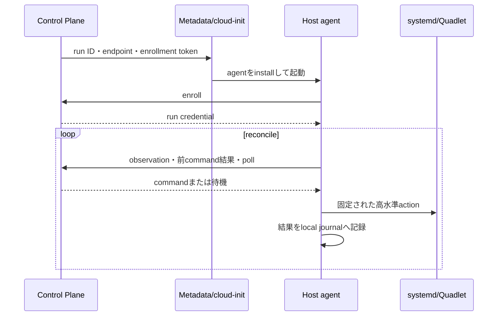

# ADR-0008: 通常のHost制御にoutbound polling Host agentを使用する

- Status: Accepted
- Date: 2026-07-22

## Context

Control Planeは一時的なLinode上でbootstrap、restore、snapshot、workload lifecycleを実行し、
各レイヤーの現在状態を観測する必要がある。SSHでcommandを逐次実行する方法は初期実装が容易だが、
任意shell、command outputの解析、接続可能性、部分実行をapplication protocolとして抱えることに
なる。また、一時VMごとにControl Planeからのinbound SSH到達性も必要になる。

専用Host agentにはprotocol、認証、version compatibility、更新、agent自身の障害を管理する負担が
ある。しかし、このシステムではHostが独立した重要な状態機械であり、typed observationと
idempotentな高水準commandを持つ価値が負担を上回る。

## Decision

通常のHost制御には専用Host agentを使用する。SSHはbreak-glassの手動調査だけに残し、
Control Plane workflowからは使用しない。

Host agentは公開portをlistenせず、Control PlaneのHTTPS endpointへoutbound pollingする。
これにより一時Linodeへの管理用inbound port、IP discovery、agent用Firewall ruleを不要にする。

### Protocol boundary

- agent commandは`inspect_host`、`prepare_runtime`、`restore_snapshot`、`start_workload`、
  `observe_workload`、`quiesce`、`create_snapshot`、`resume`、`stop_workload`のような固定語彙に限定する。
- 任意shell command、任意systemd unit、任意pathを実行するendpointは作らない。
- commandには`command_id`、`run_id`、`operation_id`、step、payload schema version、deadlineを持たせる。
- deliveryはat-least-onceとする。agentはroot disk上の小さなlocal journalへcommand ID、spec digest、
  結果を保存し、同じcommandを再実行せず同じ結果を返す。
- agentのjournalはworkflow intentの正本ではない。desired stateと次stepはControl Plane database、
  systemd/Podmanとdata directoryの現在状態はHostの観測結果が正本である。
- command結果だけを信用せず、破壊的actionの前とretry時にはsystemd、Podman、filesystemを
  再観測する。
- agentとControl Planeはprotocol versionとagent versionを交換し、非互換ならOperationを
  `blocked`にする。

### Enrollment and authentication

- cloud-init user dataにはControl Plane endpoint、run/resource identity、TLS server
  identityを検証する情報、一回限り・短命のenrollment tokenだけを含める。
- enrollment tokenはrunと作成対象resourceへbindし、Control Plane databaseにはhashだけを保存する。
  成功時に即時無効化し、未使用でも短時間でexpireさせる。
- enrollment後はrun専用の高entropy bearer credentialをHTTPS上で使用する。credentialもDBにはhash、
  Hostにはrootだけが読めるfileとして保存し、Run終了時にrevocationする。
- 公開CAのcertificateを使用できない環境では、cloud-initへ埋めた公開情報でControl PlaneのTLS
  identityをpinする。TLS検証を無効化しない。
- mTLSは初期要件にしない。単一Control Planeと短命な一時Hostに対し、private CA、certificate
  発行・rotation・失効の状態を増やすためである。bearer credentialでは不十分な脅威が具体化した
  場合に再検討する。

### Secret delivery

- Akamai token、R2 parent credential、Host enrollment tokenを同じsecretとして使い回さない。
- R2 parent credentialはControl Planeだけが保持する。restic repository passwordは使用しない。
- restore/snapshotの直前に、Server Unit prefixと必要operationへ限定した短命R2 credentialを発行し、
  authenticated agent channelでそのcommandだけに渡す。
- data credentialはagent journal、通常log、Quadlet、cloud-init、Control Plane databaseへ保存しない。
  agentはcommand実行中のsubprocess environmentへだけ展開する。
- 将来resticを独立したsystemd serviceとして起動する場合はsystemd credential機構を使う。
  secretをunit fileのliteralや広く継承されるenvironmentへ置かない。

Metadata serviceのuser dataはLinode内から取得でき、cloud-initがfirst bootで消費する。そのため、
user dataを永続secret置き場とはみなさない。一回限りのenrollment tokenだけを例外とし、取得済みの
copyが残っても再利用できない性質で影響を限定する。

## Consequences

### Positive

- 通常運用でSSHと任意shellに依存しない。
- Hostの状態と失敗をstructured dataとして観測できる。
- outbound HTTPSだけで動くため、一時VMへの管理用inbound networkを増やさない。
- commandの冪等性と再観測をprotocolに組み込める。
- 将来CLI以外のinterfaceを追加しても、同じapplication workflowを利用できる。

### Negative

- agent artifact、install、protocol schema、互換性、認証、local journalを保守する必要がある。
- Control Planeにagent用HTTPS APIを提供するprocessと設定が必要になる。
- cloud-initとagentの両方が失敗し得るため、bootstrap状態の診断経路が増える。
- agentがroot trust boundaryとなり、入力検証やservice hardeningの誤りの影響が大きい。

## Operational escape hatch

Linode作成時には手動調査用SSH公開鍵を設定する。ただしSSH鍵はControl Plane workflowのcredentialでは
なく、Host agentが応答しない場合の人間による診断専用である。通常のacceptance testはSSHなしで
完了することを要求する。

## Reconsider when

- Control Planeへ安定したHTTPS endpointを提供できない。
- agent protocolを保守する負担が、実際のHost操作の規模に対して継続的に大きい。
- threat modelの変化によりmTLS、private network、またはremote attestationが必要になった。

## References

- [Akamai Cloud Metadata service](https://techdocs.akamai.com/cloud-computing/docs/overview-of-the-metadata-service)
- [Add user data when deploying Linodes](https://techdocs.akamai.com/cloud-computing/docs/add-user-data-when-deploying-a-compute-instance)
- [Cloudflare R2 temporary credentials](https://developers.cloudflare.com/r2/api/s3/temporary-credentials/)
- [systemd service credentials](https://systemd.io/CREDENTIALS/)
