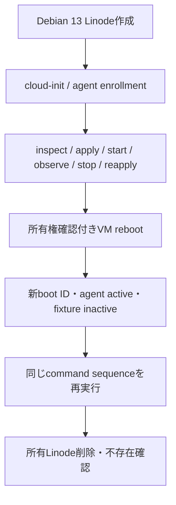

# Gate 2: Host foundation acceptance

- Implementation: Complete
- Automated verification: Complete
- Debian 13 / Akamai Cloud live acceptance: Pending

Gate 2はMinecraftを使わず、Debian 13 HostをSSHなしでbootstrap、認証、観測、制御できることを
確認する。Gate 1と同様、live checkだけがLinodeの作成と課金を行い、成功・失敗のどちらでも完全な
ownership identityに一致するLinodeの削除とAPI上の不存在確認を試みる。

## 実装済みの境界

- Control Planeはprotocol v1の`enroll`と`poll`だけをHTTPSで公開する。非loopback bindではTLS
  certificateとprivate keyが必須で、agentはcertificate検証とredirect拒否を行う。
- 認証済みpollはagentを`connected`にする。これは通信状態であり、Gate固有のcapabilityを満たす
  Hostの`ready`とは分離する。
- enrollment tokenは32 byte以上のrandom値をhashだけSQLiteへ保存し、Run identityと対象resource
  identityへbindする。一回使用後は、応答消失に備えた同一agent credentialでの再送だけを許可する。
- enrollment後のagent credentialもhashだけをControl Plane DBへ保存する。Hostではrootだけが読める
  fileへ保存し、cloud-init configからenrollment tokenを削除する。
- commandは`inspect_host`、`apply_fixture`、`start_fixture`、`observe_fixture`、`stop_fixture`の5種類に
  閉じる。任意shell、任意path、任意unit本文を受け付けない。
- Control Planeはcommandをterminal resultまで再配送する。agentは実行前にSQLite journalへ
  command IDと内容digestを保存し、同じcommandの再配送には保存済みresultを返す。
- cloud-initはDebian packageからPython 3.13、Podman 5.4、restic 0.18をinstallして互換versionを検査し、
  SHA-256を照合したHost agent wheelだけをinstallする。packageの実versionとagent versionはstructured
  bootstrap resultとheartbeatに残す。
- fixture Quadletはdigest-pinned imageから固定schemaで生成し、一時directory内のgenerator dry-runと
  `systemd-analyze verify`に成功してからatomicに配置する。
- fixture Quadletには`[Install]`を置かない。VM reboot後にfixtureが勝手に起動せず、agentだけが
  systemdから復帰してControl Planeのintentを待つことをlive checkで確認する。

## live checkが確認する順序



Host agent APIとartifact配布はControl PlaneからLinodeへ到達できるHTTPS endpointである必要がある。
一時Linode側にagent用のinbound portは不要である。Control Plane endpointのDNS、TLS certificate、
Firewallは手動管理resourceであり、このGateの自動作成対象には含めない。

## 準備

Host agent wheelをbuildする。

```bash
uv build --project host_agent --out-dir dist/host-agent
```

次の例ではDocker Official ImageのAlpine 3.24.1 multi-platform indexをfixtureに使う。digestを変更する
場合も、tagだけではなく完全な`@sha256:...`を指定する。

```text
docker.io/library/alpine@sha256:28bd5fe8b56d1bd048e5babf5b10710ebe0bae67db86916198a6eec434943f8b
```

Control Plane DBを共有してHost APIを起動する。公開interfaceへbindする場合、TLS指定を省略すると
起動を拒否する。certificateはLinodeから検証可能なSANとchainを持たせる。

```bash
uv run mc-control-plane host-api-serve \
  --database ./control-plane.db \
  --bind 0.0.0.0 \
  --port 8443 \
  --tls-certificate /path/to/fullchain.pem \
  --tls-private-key /path/to/privkey.pem \
  --agent-wheel dist/host-agent/mccp_host_agent-0.1.0-py3-none-any.whl
```

API processはwheelを固定URLから配信する。Gate 2 commandは同じlocal wheelのSHA-256をcloud-initへ
埋め込むため、API processとcheckで同じfileを指定する。

## 実行

別terminalで、一時的な`LINODE_TOKEN`を設定して実行する。region、type、Firewall、SSH公開鍵は
Gate 1で確認した値を使用できる。

```bash
export LINODE_TOKEN='temporary-purpose-scoped-token'

uv run mc-control-plane linode-gate2-check \
  --region jp-tyo-3 \
  --instance-type g6-nanode-1 \
  --firewall-id 79203454 \
  --ssh-public-key ~/.ssh/akamai_ed25519.pub \
  --database ./control-plane.db \
  --control-plane-url https://CONTROL_PLANE_HOST:8443 \
  --agent-wheel dist/host-agent/mccp_host_agent-0.1.0-py3-none-any.whl \
  --fixture-image docker.io/library/alpine@sha256:28bd5fe8b56d1bd048e5babf5b10710ebe0bae67db86916198a6eec434943f8b \
  --confirm-billable-create-reboot-delete
```

package install、image pull、VM rebootを含むためGate 1より長くかかる。既定timeoutは15分で、各pollの
進捗を表示する。成功条件は最後の行が次を含むことである。

```text
enrollment=one-time commands=idempotent quadlet=passed reboot=passed fixture=stopped cleanup=confirmed
```

強制終了などで自動cleanupを確認できなかった場合だけ、開始時の`recovery-run-id`と同じ
`--system-id`を使う。

```bash
uv run mc-control-plane linode-gate2-cleanup \
  --system-id mc-control-plane \
  --run-id gate2-REPLACE_WITH_RECORDED_ID \
  --ssh-public-key ~/.ssh/akamai_ed25519.pub \
  --confirm-owned-delete
```

## Gate判定

credential-free testではenrollment再送・悪用拒否、command再配送、agent process再開、Quadlet生成順、
cloud-init secret非表示、所有権付きreboot/deleteを検査している。実accountで上記checkが成功し、
Cloud ManagerでもLinodeが残っていないことを人間が確認した時点でGate 2全体をCompleteとする。

## 公式資料

- [Debian 13 Podman package](https://packages.debian.org/trixie/podman)
- [Debian 13 Python 3 package](https://packages.debian.org/trixie/python3)
- [Debian 13 restic package](https://packages.debian.org/trixie/restic)
- [Podman Quadlet](https://docs.podman.io/en/latest/markdown/podman-systemd.unit.5.html)
- [cloud-init package module](https://docs.cloud-init.io/en/latest/reference/modules.html#package-update-upgrade-install)
- [Docker Official Alpine image](https://hub.docker.com/_/alpine)
