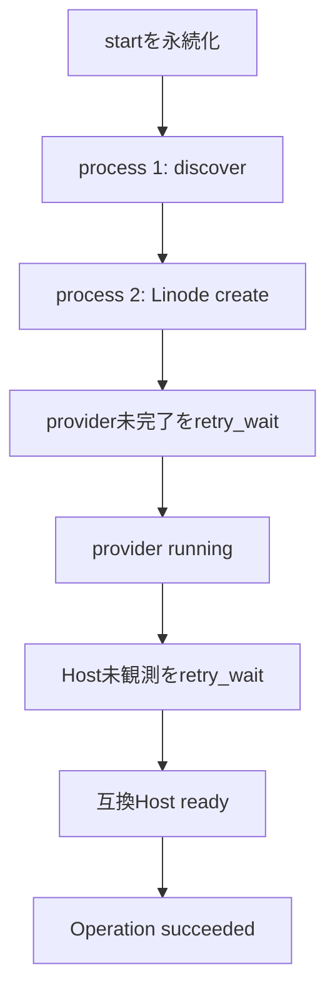

# Gate 3: Durable orchestration acceptance

- Implementation: Complete
- Automated verification: Complete
- Akamai Cloud live acceptance: Pending

Gate 3は、Gate 1のCompute lifecycleとGate 2のHost foundationを、一つの永続start Operationとして
接続する。Minecraft、restic restore、fixture commandは実行しない。成功時のLinodeはHost readyのまま
残るため、確認後に明示的なGate 3 cleanupを実行する。

## 完成させた境界

- `server-unit-create`はInfra用`RuntimeSpec`だけを登録する。container imageなどのworkload設定を
  Infra modelへ混在させない。
- `server-unit-start`はactive Runとstart Operationを一つのtransactionで確保する。同じServer Unitの
  active Run / OperationはSQLiteのpartial unique indexでも最大一つに制限する。
- reconcilerはdue Operationを短いtransactionで取得し、一つずつstart workflowへ渡す。外部APIや
  retry待機中にtransactionを保持しない。
- 一回のreconcileは外部観測可能な一stepだけ進め、次回時刻を`next_attempt_at`へ保存して返る。
- Linode create用cloud-initはRunごとの決定的な一回限りcredentialから再生成でき、token平文をDBへ
  保存しない。詳細は[ADR-0011](../decisions/0011-derive-run-enrollment.md)を参照する。
- `WAIT_HOST`はprotocol/agent version、Debian 13、Python 3.13、Podman 5.4、restic 0.18、Quadlet、
  agent serviceと30秒以内の認証済み観測を検査する。
- 一時的な未観測やprovider errorはretryし、非互換agent、無効capability、bootstrap key変更、
  所有権不一致は破壊的actionをせず`blocked`にする。
- `server-unit-status`はServer Unit、Run、Operation、provider、Hostを別レイヤーとしてJSON表示し、
  provider/Host観測時刻とageを混同しない。
- reconcilerはSIGTERM/SIGINTで現在の短いstepを終えて停止でき、次processがSQLiteのstepから再開する。

SQLite DB、Host API、reconcilerは同じControl Plane host上で動かす。WALはreaderとwriterの並行動作を
助けるが、network filesystem越しに共有する構成や複数reconciler workerはこのGateの対象外である。

## 自動testが固定するscenario



各cycleでreconciler objectを作り直し、SQLiteだけを引き継いでもLinode createが一回であることを確認する。
別scenarioでは非互換agentを`blocked`にし、追加Compute actionがないことを確認する。明示的cleanupは完全な
`system_id + server_unit_id + run_id` identityだけを削除し、外部不存在を確認してからRunを終了する。

## 準備

Gate 2と同じHost agent wheelをbuildし、Host APIを同じDBで起動する。Caddyの公開pathもwheel
`0.1.1`に一致させる。

```bash
uv build --project host_agent --out-dir dist/host-agent

uv run mc-control-plane host-bootstrap-key-create ./host-bootstrap.key

uv run mc-control-plane host-api-serve \
  --database ./control-plane.db \
  --bind 127.0.0.1 \
  --port 8443 \
  --agent-wheel dist/host-agent/mccp_host_agent-0.1.1-py3-none-any.whl
```

bootstrap keyは一度だけ作成する。既存fileを上書きせず、mode `0600`以外ではreconcilerが起動を拒否する。
active Run中に削除・交換しない。

## Server Unitとstart要求

この例のIDはGate 3専用とし、既存Server Unitを流用しない。

```bash
uv run mc-control-plane server-unit-create \
  --database ./control-plane.db \
  --id gate3-survival \
  --name "Gate 3 Survival" \
  --region jp-tyo-3 \
  --instance-type g6-nanode-1 \
  --firewall-id 79203454

uv run mc-control-plane server-unit-start \
  --database ./control-plane.db \
  --server-unit-id gate3-survival
```

## process再開を含む実行

一時的な`LINODE_TOKEN`を設定する。最初の二回を`--once`で別processとして実行すると、第一processは
`DISCOVER_RUNTIME -> CREATE_RUNTIME`を保存し、第二processがLinodeを一度だけ作成する。

```bash
export LINODE_TOKEN='temporary-purpose-scoped-token'

uv run mc-control-plane reconciler-run \
  --database ./control-plane.db \
  --host-bootstrap-key ./host-bootstrap.key \
  --control-plane-url https://mc-control-plane.hss-science.org \
  --agent-wheel dist/host-agent/mccp_host_agent-0.1.1-py3-none-any.whl \
  --fixture-image docker.io/library/alpine@sha256:28bd5fe8b56d1bd048e5babf5b10710ebe0bae67db86916198a6eec434943f8b \
  --system-id mc-control-plane \
  --ssh-public-key ~/.ssh/akamai_ed25519.pub \
  --once
```

同じcommandをもう一度実行した後、`--once`を外して常駐loopを開始する。`WAIT_PROVIDER`または
`WAIT_HOST`中に一度Ctrl-Cで終了し、同じcommandで再起動する。長いsleepを復元する必要はなく、DBの
`next_attempt_at`を過ぎれば自動で継続する。

別terminalから状態を確認する。

```bash
uv run mc-control-plane server-unit-status \
  --database ./control-plane.db \
  --server-unit-id gate3-survival
```

合格時は次をすべて満たす。

- `operation.state`が`succeeded`、`operation.step`が`complete`である。
- `provider.status`が`running`で、Linodeは一つだけである。
- `host.status`が`connected`で、`host.age_seconds`が観測期限内である。
- capabilityがDebian 13、Python 3.13、Podman 5.4、restic 0.18、Quadletを示す。
- reconciler再起動後も同じRun IDとprovider resource IDが維持される。

## cleanup

Gate 3は通常のstop/data保護workflowをまだ実装していないため、次はacceptance専用cleanupである。
DB上のactive Runから完全なownership identityを再構成し、一致するLinodeだけを削除する。APIの404と
tag検索`matches=0`を確認してから、local Runtimeをdeleted、Runをended、desired stateをstoppedにする。

```bash
uv run mc-control-plane linode-gate3-cleanup \
  --database ./control-plane.db \
  --server-unit-id gate3-survival \
  --system-id mc-control-plane \
  --ssh-public-key ~/.ssh/akamai_ed25519.pub \
  --confirm-owned-delete
```

成功行が`absent=yes`を含み、Cloud ManagerにもLinodeが残っていないことを確認する。cleanupを再実行して
`run=none resources=none absent=yes`になることも正常である。

## Gate判定

上記のprocess再開後にHost readyへ到達し、重複Linodeがなく、明示的cleanupで外部・DB双方のactive
resourceがなくなったことをproject ownerが確認した時点でGate 3全体をCompleteとする。それまでは
実装と自動testだけがCompleteであり、Gate 4の設計準備はできても実環境完了とは扱わない。

## 公式資料

- [SQLite Write-Ahead Logging](https://www.sqlite.org/wal.html)
- [Python `sqlite3` transaction control](https://docs.python.org/3/library/sqlite3.html)
- [Python signal handlers](https://docs.python.org/3/library/signal.html)
- [systemd service](https://www.freedesktop.org/software/systemd/man/systemd.service.html)
