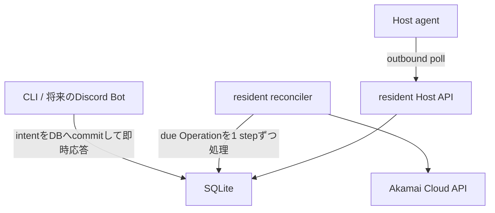

# 通常運用

Gate acceptance harnessを毎回実行する必要はない。通常運用ではControl Plane VM上で二つのserviceを
常駐させ、人間は短いCLIでintentを登録・照会する。



CLIを閉じてもOperationは失われず、常駐reconcilerが継続する。`--wait`はCLIが進捗表示をpollするだけで、
処理の実行主体や寿命をCLIへ移さない。

## 1. 一度だけ行う配置

このrepositoryはprivate single-node deploymentとして`opc` userと
`/home/opc/mc-control-plane`を前提にする。第三者向けpackageや汎用installerではない。

```bash
cd /home/opc/mc-control-plane

uv sync --frozen
uv build --project host_agent --out-dir dist/host-agent

sudo ./deploy/single-node/install.sh
```

次のファイルを実環境の値で用意する。

- `/etc/mc-control-plane/config.toml`: 非secret設定。sampleは
  `deploy/single-node/config.example.toml`
- `/etc/mc-control-plane/secrets.env`: `LINODE_TOKEN`だけ。`root:opc`, mode `0640`
- `/etc/mc-control-plane/cloudflare-api-token`: Cloudflare API tokenだけ。`opc:opc`, mode `0600`
- `/etc/mc-control-plane/host-bootstrap.key`: installerが未作成時だけ生成。`opc:opc`, mode `0600`
- `/etc/mc-control-plane/akamai_ed25519.pub`: Execution Hostへ渡す公開鍵

Host agent artifactの公開URLはversionに依存しない
`/artifacts/host-agent.whl`である。cloud-initは別途SHA-256を検証するため、URLを固定しても
古いartifactや改ざんを受け入れない。Caddy設定例は
`deploy/single-node/Caddyfile.example`を使う。

設定とlocal fileを検証し、serviceを開始する。

```bash
sudo -u opc env \
  LINODE_TOKEN="$(sudo sed -n 's/^LINODE_TOKEN=//p' /etc/mc-control-plane/secrets.env)" \
  /usr/local/bin/mc-control-plane node-check

sudo systemctl enable --now mc-control-plane.target

systemctl status \
  mc-control-plane-host-api.service \
  mc-control-plane-reconciler.service \
  --no-pager
```

以後、`uv run`や`nohup`は通常運用に使わない。logは次で確認する。

```bash
journalctl -u mc-control-plane-host-api.service -f
journalctl -u mc-control-plane-reconciler.service -f
```

## 2. Server Unit登録

登録はServer Unitごとに一度だけ行う。現時点では詳細指定用の管理commandを使う。

```bash
mc-control-plane server-unit-create \
  --database /var/lib/mc-control-plane/control-plane.db \
  --id survival \
  --name "Survival" \
  --region jp-tyo-3 \
  --instance-type g6-nanode-1 \
  --image linode/debian13 \
  --firewall-id 79203454 \
  --minecraft-image "$MINECRAFT_IMAGE" \
  --minecraft-version "$MINECRAFT_VERSION" \
  --paper-build "$PAPER_BUILD" \
  --minecraft-memory 512M \
  --accept-minecraft-eula
```

Control Planeが意味を理解するのは、Linodeを作る`RuntimeSpec`とcontainerを再現する最小の
`MinecraftSpec`だけである。`server.properties`、Paper設定、plugin、world、plugin dataは
`/data`内の不透明なpayloadであり、Control Planeの設定項目やdomain modelへ展開しない。

## 3. 日常操作

既定では`/etc/mc-control-plane/config.toml`からDBを解決する。

```bash
mc-control-plane start survival
mc-control-plane status survival
mc-control-plane snapshot survival
mc-control-plane snapshots survival
mc-control-plane stop survival
```

要求commandはOperation IDを返してすぐ終了する。terminal上で完了まで確認したい場合だけ
`--wait`を付ける。

```bash
mc-control-plane start survival --wait
mc-control-plane snapshot survival --wait
mc-control-plane stop survival --wait
```

`--wait`がtimeoutしてもOperationはbackgroundで継続する。別snapshotを指定する場合は次を使う。

```bash
mc-control-plane start survival --snapshot <snapshot-id>
```

## 4. 競合とblocked

進行中Operationがあると別要求は拒否され、現在のoperation ID、kind、state、stepが表示される。
進行中処理を中断せず、暗黙queueも作らない。完了後に操作を再実行する。

`blocked`は自動で進めるべきでない失敗である。原因をstatusとjournalで確認し、修正後に管理commandで
同じOperationを明示的に再開する。

```bash
mc-control-plane retry <operation-id>
```

resource所有権不一致や原因不明のdata errorを、確認せずretryしない。

## 5. 非同期性と現在の上限

- Host APIとreconcilerは別systemd processとして同時に稼働する。
- Host APIはrequestごとにthreadを分けるため、一つのHost pollが他Hostのpollを直列待ちさせない。
- reconcilerはdue Operationを取得し、各Operationを一つの短い・永続的なstepだけ進める。
- VM ready、Host enrollment、Minecraft ready、snapshot完了はDB上の`retry_wait`へ戻し、次cycleで
  再観測する。常駐process内で数分間sleepして待たない。
- provider HTTPとHost側subprocessにはtimeoutがある。一つのprovider call中は他Operationのcycleが
  最大そのtimeout分遅れるが、永遠には停止しない。単一Control Planeと小規模運用ではこの単純さを選ぶ。

複数のServer Unitを大量に同時操作し、30秒程度のprovider I/O遅延も許容できなくなった場合にだけ、
claim付きworker poolを設計する。現時点で`asyncio`や複数writerを加えると、SQLite ownershipと
operation claimが複雑になるため導入しない。
