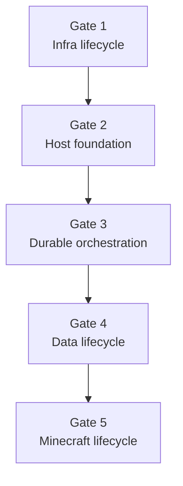

# 中期目標: Operational MVP

## 1. 目標

中期目標は、**再利用可能なInfra/Host基盤の上で、一つのServer Unitのstart、運用、snapshot、
stop、再restoreを人間のSSH操作なしで一周できること**とする。

Minecraftが一度起動するだけでは完成としない。Akamai Cloud resource ownership、Debian 13の
再現可能なbootstrap、認証されたHost protocol、systemd/Quadlet lifecycle、data保護を先に
独立して検証し、その上へMinecraft adapterを載せる。

Gateは実装順であり、後段のdemoが動いても前段のacceptance criteriaを省略しない。

## 2. 現在地

### 完了している土台

- Domain modelとactive Run / Operationの排他条件
- SQLite schema、migration、Unit of Work
- 永続Operationを一stepずつ進めるstart workflowのCompute部分
- 所有tagによるLinode検索、作成、状態観測、安全な削除を行う公式SDK adapter
- provider status mapping、timeout後の再発見、所有権検査の自動test
- Debian 13/Metadata/Firewall preflight、cloud-init Metadata create入力
- Linode Interfaces限定networking、local disk encryption無効化と作成後観測
- 明示的な課金確認、所有権限定cleanupを持つGate 1 live acceptance harness
- protocol v1、一回限りenrollment、Host observation、command queueのSQLite永続化
- Debian 13用の独立Python 3.13 Host agent、local command journal、HTTPS polling
- checksum検証済みagent artifactをinstallするcloud-initと固定schemaのfixture Quadlet
- Linode rebootと二回のfixture lifecycleを含むGate 2 live acceptance harness
- Gate 2の実account live acceptanceと削除後の不存在確認
- Runごとの再現可能なHost bootstrap、一回限りenrollment、root-only derivation key
- due Operationを処理する単一reconciler、`WAIT_HOST` readiness判定、レイヤー別status CLI

start workflowは永続stepからLinodeを一度だけ作成し、互換性と鮮度を満たすHostを観測して
Gate 3の`COMPLETE`へ進むところまで実装済みである。

### 未実装

- Gate 3 harnessの実accountによるlive acceptance
- restic/R2 restore、snapshot、retention
- Minecraft start/readiness/stop、定期snapshot

## 3. Gateと完成条件

### Gate 1: Infra lifecycle

Linode adapterを実accountで安全に使える状態へ完成させる。

Status: **Complete**。2026-07-22に`jp-tyo-3` / `g6-nanode-1`で実accountのlive acceptanceと
削除後確認まで完了した。実行手順と実測結果は
[Gate 1 acceptance](gates/01-infra-lifecycle.md)に固定する。

- Debian 13 image、instance type、region、手動Firewall参照を設定から検証できる。
- metadata user dataをcreate requestへ渡せる。
- credentialがない通常testと、明示的に有効化する課金ありintegration testを分離する。
- integration testで`create -> observe running -> ownership check -> delete -> absent`を確認する。
- test resourceに一意なownership tagと期限情報を付け、cleanup commandは所有権一致時だけ削除する。
- create timeout、未知resource、未知provider statusでは重複作成・削除をしない。

各Gateは「実装・自動test完了」と「実環境acceptance完了」を区別する。必要に応じて後者を
project ownerが実行し、Minecraftを導入する前にInfra、Host、Dataの実環境境界を確認する。

### Gate 2: Host foundation

Minecraftを使わないfixture containerで、Debian 13 Hostのbootstrapと制御を完成させる。

Status: **Complete**。2026-07-22にreboot前後の二回のfixture sequence、agent再接続、
所有Linodeの削除とtag検索上の不存在まで実accountで確認した。実行手順と結果は
[Gate 2 acceptance](gates/02-host-foundation.md)に固定する。

- cloud-initはPodman、restic、Python 3.13、Host agentを再現可能にinstallする。
- artifact、OS image、package前提をversion/checksumで固定し、bootstrap結果をstructuredに報告する。
- Host agentはoutbound HTTPSで一回限りenrollmentを行い、heartbeat、version、capabilityを報告する。
- protocolは固定schemaと限定commandだけを受け付け、任意shell endpointを持たない。
- command再配送、agent再起動、Control Plane再起動でもlocal journalと再観測により安全に再開する。
- Quadletを生成前検証し、適用、start、observe、stop、再適用できる。
- agent service、fixture service、VM reboot後の状態をsystemdとjournalから説明できる。
- 長期・再利用可能なsecretがcloud-init、Quadlet、journal、通常log、Control Plane DBへ残らず、
  cloud-init上のenrollment tokenが一回使用後または期限後に無効なことをtestする。
- SSHを使わずに上記acceptance testが完了する。

Gate 2を通過するまで、Minecraft固有のreadinessやserver commandをHost protocolへ追加しない。

### Gate 3: Durable orchestration

Control Planeを常駐processとして動かし、InfraとHostの状態機械を永続workflowで結ぶ。

Status: **Complete**（2026-07-22）。project ownerが、同一Operation/Runのprocess再開、Host ready、
重複Linodeなし、明示cleanup後のprovider/DB双方のabsenceを実accountで確認した。実行手順は
[Gate 3 acceptance](gates/03-durable-orchestration.md)に固定する。

- due Operationを一stepずつ処理する単一reconcilerを実装する。
- `server-unit create`、`start`、`status`と操作詳細をCLIから扱える。
- provider observationとHost observationを独立して保存し、古さとerrorを表示する。
- Control Planeの各step間再起動と、Host agentのpoll切断・再接続から再開できる。
- timeoutは長いsleepではなく`next_attempt_at`へ保存し、外部I/O中にDB transactionを保持しない。
- incompatible agent、bootstrap失敗、所有権不明は破壊的actionをせず`blocked`になる。

### Gate 4: Data lifecycle

Minecraftを起動する前に、R2上のrestic repositoryとroot diskのdata lifecycleを完成させる。

Status: **実装と自動testは完了、実accountのlive acceptance待ち**。実行手順は
[Gate 4 acceptance](gates/04-data-lifecycle.md)に固定する。

- Server Unitごとのrepository/prefixを初期化し、記録したsnapshot IDを明示してrestoreできる。
- restore先をRun専用directoryに限定し、path traversalや別Server Unitへの書き込みを拒否する。
- snapshot成功はrestic終了コードとsnapshot IDで確認し、Control Planeへcommitする。
- R2 temporary credentialを必要なbucket/prefix/operation/TTLへ限定し、実行時だけagentへ渡す。
- restore/snapshotの再配送と途中失敗がdata分裂や重複したdomain recordを起こさない。
- `snapshot commit -> Linode delete`の順序を自動testで固定する。
- 小さなfixture dataで`restore -> modify -> snapshot -> fresh hostへrestore`を確認する。

### Gate 5: Minecraft lifecycle

完成したHost/Data基盤へ`itzg/minecraft-server` adapterを載せ、最小の利用価値を完成させる。

- imageをversion/digestで固定したQuadletを適用する。
- root diskのpayloadをbind mountし、start、readiness、graceful stopを観測する。
- 正常停止後にsnapshotをcommitし、それからLinodeを削除してRunを終了する。
- 長時間Runに対するquiesce、定期snapshot、resumeを実装する。snapshot失敗時もresumeする。
- 新しいLinodeで最後にcommitしたsnapshotをrestoreし、同じServer Unitを再起動できる。
- 一つのServer Unitにactive Runが最大一つであることを実環境を含むscenarioで確認する。

## 4. Operational MVPのend-to-end acceptance

次の一連の操作を通常のCLIだけで実行できれば、中期目標を達成したと判断する。

1. Server Unitを登録し、既存snapshotまたは空dataからstartを要求する。
2. Control PlaneがDebian 13 Linodeを作成し、Host agentの認証済みreadyを待つ。
3. agentがdataをrestoreし、検証済みQuadletからMinecraftを起動してreadyを報告する。
4. Control Planeとagentをそれぞれ一度再起動しても、Runと観測を再開できる。
5. 手動snapshotと少なくとも一回の定期snapshotを作成し、snapshot IDを記録する。
6. stop要求でMinecraftを正常停止し、最終snapshot commit後にだけLinodeを削除する。
7. 再度startし、新しいLinodeへ同じsnapshotをrestoreできる。

この間、通常運用でSSH、Linode Cloud Manager上の手動操作、VM terminal操作を要求しない。
失敗時にはoperation、step、provider/host/workload/data observation、短いerror codeから、次に
人間が確認すべき境界を特定できる。

## 5. 品質の基準

Infra/Hostを「後で直す仮実装」にしないため、各Gateに次を要求する。

- Domain/applicationはfakeを使うdeterministic unit/scenario testを持つ。
- 外部adapterはcontract testを持ち、実credentialを使うtestはopt-inにする。
- create、delete、restore、snapshot、start、stopにはtimeoutと再観測規則を持つ。
- 破壊的actionはresource identity、ownership、現在状態を直前に検査する。
- logへtoken、R2 credential、Minecraft payloadを出さない。
- protocol、schema、cloud-init、Quadletはrepositoryでversion管理し、生成結果をtestする。
- 実環境で発見した挙動は再現可能なtestまたはADRへ戻す。

高可用性や稀なprovider障害への完全自動復旧は求めない。ただし、通常のretry、process restart、
command再配送でresource重複やdata削除を起こさないことは必須とする。

## 6. 中期目標に含めないもの

- Discord Bot、Web UI
- 複数Control Plane、複数worker、message broker
- 複数cloud provider、複数region failover
- Block Storage Volume
- Minecraft設定、plugin、world生成内容の編集
- 自動container/OS upgrade
- 高度なretention UI、repository間migration
- 商用service級のSLO、無停止backup、zero-RPO

## 7. 直近の実装順

1. Project ownerがGate 3 live acceptanceを実行し、process再起動後の再開とcleanupを確認する。
2. 結果をGate 3文書へ記録してCompleteとする。
3. Gate 4でrestic/R2のdata lifecycleをfixture dataから実装する。
4. Data境界を実環境で確認した後にMinecraft lifecycleへ進む。

各項目は小さなcommitへ分けるが、Gateのacceptance criteriaを満たすまでは次Gateを
「完成」と扱わない。
