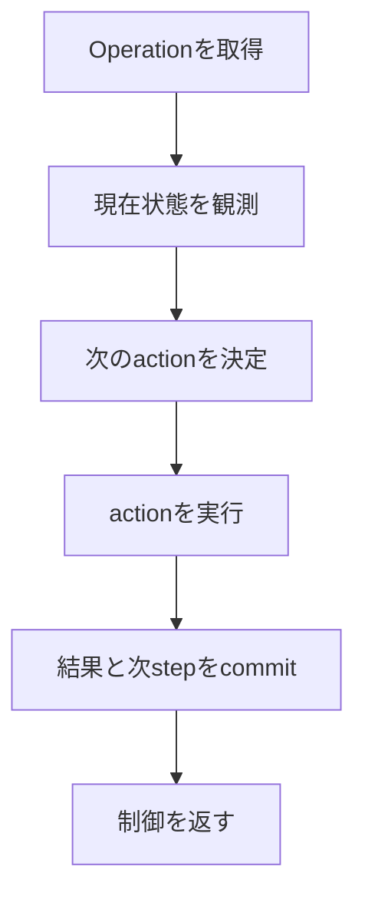

# Project structure

## 1. 結論

project全体はdomain、application、adapter、独立Host agentへ分ける。すべての抽象化を先に作らず、
実装済みvertical sliceに必要なinterfaceだけを維持する。

Akamai Cloudは最初に接続する外部システムですが、architectureの根幹ではありません。
根幹はdomain invariantと、途中状態を永続化して一stepずつ進めるapplication workflowです。

## 2. 現在のdirectory構成

```text
src/mc_control_plane/
├── domain/
│   ├── models.py
│   ├── states.py
│   └── errors.py
├── application/
│   ├── commands/          # request受付
│   ├── workflows/start.py # 永続Start workflow
│   ├── queries/status.py
│   ├── ports/             # persistence / compute / host
│   ├── reconciler.py
│   ├── host_protocol.py
│   ├── data_lease.py
│   └── gate4.py, gate5.py # acceptance coordinator
├── adapters/
│   ├── inbound/
│   │   ├── cli.py
│   │   └── host_api.py
│   └── outbound/
│       ├── persistence/   # SQLite、Host protocol store
│       ├── compute/       # Linode SDK、Gate 1/2 harness
│       ├── host/          # cloud-init、durable Host identity
│       └── storage/       # R2 temporary credential broker

host_agent/
├── pyproject.toml         # Debian 13 / Python 3.13 package
└── src/mccp_host_agent/
    ├── agent.py
    ├── client.py
    ├── journal.py
    └── runtime.py         # systemd、Podman、restic、Minecraft

tests/
├── host_agent/
├── unit/
├── integration/
└── fakes.py

docs/
├── gates/
├── decisions/
├── architecture.md
├── operational-mvp.md
├── project-structure.md
└── state-machines.md
```

fileは行数だけで分割しない。domain entityは変更理由が共通する間は`models.py`へ置く。Gate 4/5は
実環境acceptance coordinatorであり、通常運用use caseの正本ではない。検証済みprimitiveをStart、
Stop、Snapshot workflowへ移す段階で、共有application serviceを抽出する。

## 3. 各packageの責務

### domain

外部I/Oを行わない純粋なmodelと規則です。

- `ServerUnit`
- `RuntimeSpec`
- `Run`
- `RuntimeInstance`
- committed `Snapshot`
- `Operation`
- state valueとdomain error
- active RunやOperation競合に関する不変条件

Domain objectはLinode SDK object、ORM model、CLI optionを直接持ちません。

### application

use caseと永続workflowを実装します。Domain objectとportだけへ依存します。

- start、stop、snapshot要求の受付
- Operationの次の一stepを決めるreconciliation
- transaction境界
- idempotencyとretry判断
- 複数adapterの呼び出し順序

一度の関数呼び出しでstart workflow全体を長時間実行し続ける設計にはしません。
現在のstepと観測結果から次のactionを一つ決め、結果を保存してから制御を返します。
これによりControl Plane再起動後も同じworkflowを再開できます。

### ports

Applicationが必要とするcapabilityを小さなinterfaceとして定義します。

| Port | 現在の責務 |
| --- | --- |
| `UnitOfWork` | transaction、entity取得、変更のcommit/rollback |
| `ComputeProvider` | 所有resourceの検索、作成、観測、削除 |
| `HostBootstrapProvider` | Run固有cloud-init Metadataの生成 |
| `HostObservationProvider` | 認証済みHost observationの取得 |
| `DataLeaseProvider` | commandに応じた短期R2 credentialの発行 |
| `Clock` | timeout、retry時刻をtest可能にする時刻取得 |
| `IdGenerator` | Run ID、Operation IDの生成 |

PortはAkamaiやresticのAPIをそのまま写したものではなく、application use caseが必要とする
語彙で定義する。workload/data actionは現在closed Host protocol commandとして実証されており、
product workflowへ接続するときに必要なapplication-level interfaceを抽出する。

### adapters

外部技術との変換を担当します。

- inbound adapterはCLI入力をcommandへ変換し、結果を表示する。
- persistence adapterはtransactionとdatabase schemaを実装する。
- Akamai adapterは`ComputeProvider`を実装する。
- Host adapterはcloud-initとRun固有enrollmentを生成し、Host APIはclosed protocolを提供する。
- storage adapterはCloudflare temporary credentialを発行する。restic自体はHost agentが実行する。

### composition root

現在は`adapters/inbound/cli.py`がCLIとcomposition rootを兼ねる。設定を読み、adapterを生成して
applicationへ注入し、domainやworkflow内部でSDK clientやdatabaseを直接生成しない。通常運用commandが
増えてCLIの変更理由が分かれた時点で、parser、composition、command handlerを別moduleへ分割する。

## 4. Workflow実装モデル

Operationには少なくとも次を記録します。

```text
operation_id
server_unit_id
run_id
kind
state
step
attempt_count
next_attempt_at
last_error_code
last_error_message
created_at
updated_at
```

errorの完全なstack traceはlogへ送り、DBには機械的な判断に必要なcodeと短いmessageだけを
残します。外部actionの前後でstepを記録し、timeout時は実状態を再観測します。



## 5. 実装順序

### Milestone 1: 骨格と純粋なworkflow

1. `src` layout、test、lint、type checkの入口を用意する。
2. Domain model、state、errorを定義する。
3. Portを必要最小限だけ定義する。
4. SQLite repositoryとfake external adapterを作る。
5. start workflowの「Run確保からCompute作成要求まで」をtestする。
6. 同時start、create timeout、既存resource発見をscenario testする。

この段階ではcloud accountへ接続しません。

### Milestone 2: Akamai Cloud vertical slice（自動testまで完了）

1. `ComputeProvider`のAkamai adapterを実装する。（完了）
2. 所有tagによる検索、create、status観測、deleteを実装する。（完了）
3. 状態mapping、provider制約、error分類、安全条件を自動testする。（完了）
4. test用Linode一つでcreate、再観測、deleteを行うlive acceptanceを完了する。（完了）

このMilestoneではInfrastructure全体を一度に実装せず、Linode lifecycleだけを接続しました。
cloud-initとHostはMilestone 3で接続し、resticは後続Gateまでfakeのままとします。

### Milestone 3: Infra integrationとHost foundation（完了）

1. opt-inのLinode lifecycle integration harnessを用意する。（完了）
2. metadata user dataをCompute createへ接続する。（完了）
3. outbound Host agentのprotocol、enrollment、local journalを実装する。（完了）
4. Debian 13 cloud-initとfixture Quadletを検証する。（完了）
5. Host observationを保存する。（完了）
6. start workflowの`WAIT_HOST`を接続する。（Gate 3で完了）

Minecraftを起動する前に、SSHなしでfixture containerのapply、start、observe、stop、agent/VM rebootを
通過させます。詳細なacceptance criteriaは[Operational MVP](operational-mvp.md)のGate 1、2を
参照してください。

### Milestone 4: Reconciler processと再開

1. due Operationを一stepずつ進める単一reconciler loopを実装する。（完了）
2. CLIからServer Unit、Operation、レイヤー別観測を扱えるようにする。（完了）
3. Control Planeをstep間で再起動しても再開できることをtestする。（自動test完了）
4. process終了とgraceful shutdownを実装する。（完了）
5. 実accountでprocess再開とHost ready到達を確認する。（完了）

### Milestone 5: DataとMinecraft lifecycle

1. R2 temporary credentialとrestic restore/snapshotをfixture dataで接続する。（live acceptance完了）
2. `itzg/minecraft-server` Quadletのstart、readiness、graceful stopを接続する。（live acceptance完了）
3. snapshot commit後だけLinodeを削除するworkflowを完成させる。（Gate 4 fixtureで実装）
4. 手動snapshotのquiesce/resumeと中断復旧を追加する。（live acceptance完了）
5. fresh LinodeへのMinecraft再restore/restartを確認する。（live acceptance完了）
6. 定期snapshot、schedule、retention maintenanceはGate 5後に別計画で追加する。

CLIは各Milestoneを手動で動かせる薄い入口として早期に用意します。
Discord adapterはstart/stop workflowが安定した後に追加します。

## 6. 技術判断

次は決定済みです。

- SQLiteとversion付きmigrationを使用する。
- 同期application coreと、永続Operationを一stepずつ進める単一reconcilerを使用する。
- task queue、message broker、複数writerは使用しない。
- Execution HostはDebian 13とし、systemd / Podman Quadletを使用する。
- 通常のHost制御にはoutbound polling agentを使い、SSHはbreak-glass専用とする。
- Host agentはDebian 13標準Python 3.13をsupportする独立packageとして配布する。
- Host agentとrootful Podmanはrootで管理し、Minecraft process/dataは固定された非login UID/GIDへ
  分離する。
- Control PlaneのHost APIはHTTPSで固定schemaのversioned protocolだけを公開する。
- Host commandはat-least-onceで配送し、agentのlocal journalで実行を冪等にする。
- test用Akamai Cloud resourceには完全なownership identityを付け、自動cleanupする。

次は必要になる直前に短いADRとして決めます。

- configuration file schemaとControl Plane secret storeの配置

一方、Discord framework、複数worker、汎用plugin system、複数cloud対応は現時点では決めません。

## 7. 実装済みの基礎不変条件

次の基礎条件は、実cloudを使わず自動testしている。

- 同じServer Unitへの同時startの片方が拒否される。
- 同じOperationを再実行してもCompute resourceを重複作成しない。
- create timeout後に既存resourceを観測して採用できる。
- 所有tagが一致しないresourceを削除しない。
- 各stepの途中で再起動した想定でもworkflowを再開できる。

この土台とGate 1から5のlive acceptanceは完成している。Gate 5では2台のfresh LinodeでPaper start、
quiesced snapshot、graceful stop、停止後snapshot、内容一致restore、restart、cleanupを確認した。

次の実装境界は、Gate harness内の一連の処理を通常運用の永続Start、Stop、Snapshot Operationと個別CLIへ
接続することである。中期目標全体の完成条件は[Operational MVP](operational-mvp.md)を正本とする。
