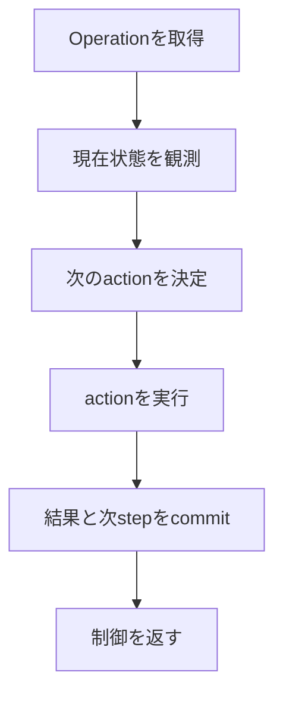

# Project structure

## 1. 結論

最初にproject全体の骨格と依存方向を決めます。ただし、すべての抽象化を先に作るのではなく、
`ServerUnit start`の一つのvertical sliceに必要な最小構成だけを作ります。

Akamai Cloudは最初に接続する外部システムですが、architectureの根幹ではありません。
根幹はdomain invariantと、途中状態を永続化して一stepずつ進めるapplication workflowです。

## 2. 推奨directory構成

```text
src/mc_control_plane/
├── domain/
│   ├── models.py
│   ├── states.py
│   └── errors.py
├── application/
│   ├── commands.py
│   ├── workflows/
│   │   ├── start.py
│   │   ├── stop.py
│   │   └── snapshot.py
│   └── ports/
│       ├── persistence.py
│       ├── compute.py
│       ├── runtime.py
│       └── snapshots.py
├── adapters/
│   ├── inbound/
│   │   └── cli/
│   └── outbound/
│       ├── persistence/
│       ├── akamai/
│       ├── host/
│       └── restic/
├── config.py
└── bootstrap.py

tests/
├── unit/
│   ├── domain/
│   └── application/
├── contract/
├── integration/
└── e2e/

docs/
└── decisions/
```

初期段階ではファイルを細かく分けすぎません。例えばdomain entityが少ない間は`models.py`へ置き、
責務や変更理由が明確に分かれてからpackageへ分割します。

## 3. 各packageの責務

### domain

外部I/Oを行わない純粋なmodelと規則です。

- `ServerUnit`
- `RuntimeSpec`
- `Run`
- `RuntimeInstance`
- committed `Snapshot`
- `Operation`
- state valueとdomain error
- active RunやOperation競合に関する不変条件

Domain objectはLinode SDK object、ORM model、CLI optionを直接持ちません。

### application

use caseと永続workflowを実装します。Domain objectとportだけへ依存します。

- start、stop、snapshot要求の受付
- Operationの次の一stepを決めるreconciliation
- transaction境界
- idempotencyとretry判断
- 複数adapterの呼び出し順序

一度の関数呼び出しでstart workflow全体を長時間実行し続ける設計にはしません。
現在のstepと観測結果から次のactionを一つ決め、結果を保存してから制御を返します。
これによりControl Plane再起動後も同じworkflowを再開できます。

### ports

Applicationが必要とするcapabilityを小さなinterfaceとして定義します。

| Port | 最初に必要な責務 |
| --- | --- |
| `UnitOfWork` | transaction、entity取得、変更のcommit/rollback |
| `ComputeProvider` | 所有resourceの検索、作成、観測、削除 |
| `RuntimeControl` | Host readiness、workload start/stop、quiesce/resume |
| `SnapshotStore` | runtimeへのrestore、snapshot作成・取得・検証・maintenance |
| `Clock` | timeout、retry時刻をtest可能にする時刻取得 |
| `IdGenerator` | Run ID、Operation IDの生成 |

PortはAkamaiやresticのAPIをそのまま写したものではなく、application use caseが必要とする
語彙で定義します。

### adapters

外部技術との変換を担当します。

- inbound adapterはCLI入力をcommandへ変換し、結果を表示する。
- persistence adapterはtransactionとdatabase schemaを実装する。
- Akamai adapterは`ComputeProvider`を実装する。
- Host adapterは選択したhost protocolを`RuntimeControl`へ変換する。
- restic adapterはcommandとJSON出力を`SnapshotStore`へ変換する。

### bootstrap

設定を読み、adapterを生成し、applicationへ注入します。
依存objectの生成をdomainやworkflow内部へ散らしません。

## 4. Workflow実装モデル

Operationには少なくとも次を記録します。

```text
operation_id
server_unit_id
run_id
kind
state
step
attempt_count
next_attempt_at
last_error_code
last_error_message
created_at
updated_at
```

errorの完全なstack traceはlogへ送り、DBには機械的な判断に必要なcodeと短いmessageだけを
残します。外部actionの前後でstepを記録し、timeout時は実状態を再観測します。



## 5. 実装順序

### Milestone 1: 骨格と純粋なworkflow

1. `src` layout、test、lint、type checkの入口を用意する。
2. Domain model、state、errorを定義する。
3. Portを必要最小限だけ定義する。
4. in-memory repositoryとfake adapterを作る。
5. start workflowの「Run確保からCompute作成要求まで」をtestする。
6. 同時start、create timeout、既存resource発見をscenario testする。

この段階ではcloud accountへ接続しません。

### Milestone 2: Akamai Cloud vertical slice

1. `ComputeProvider`のAkamai adapterを実装する。
2. 所有tagによる検索、create、status観測、deleteを実装する。
3. fakeと実adapterへ共通のcontract testを適用する。
4. test用Linode一つでcreate、再観測、deleteを手動実行するintegration testを用意する。

Infrastructure全体を一度に実装せず、Linode lifecycleだけを接続します。
cloud-init、Host、resticはまだfakeのままにします。

### Milestone 3: 永続化と再開

1. database schemaとmigrationを実装する。
2. active Runと変更系Operationの一意制約を実装する。
3. Control Planeをstep間で再起動しても再開できることをtestする。
4. provider上の既存resourceをtagから再発見できることをtestする。

### Milestone 4: Hostとrestore

1. cloud-initの最小bootstrapを定義する。
2. Host protocolとreadinessを実装する。
3. restic restoreを接続する。
4. Minecraft containerのstartとreadinessを接続する。

### Milestone 5: stopとsnapshot

1. graceful stopを接続する。
2. restic snapshotとsnapshot ID記録を接続する。
3. snapshot commit後だけLinodeを削除するworkflowを完成させる。
4. 定期snapshotとretention maintenanceを追加する。

CLIは各Milestoneを手動で動かせる薄い入口として早期に用意します。
Discord adapterはstart/stop workflowが安定した後に追加します。

## 6. 最初に決める必要がある技術判断

次の判断はproject skeletonを実装する前または同時に、短いADRとして決めます。

- databaseとmigration手段
- sync/async execution model
- workflowを起動するprocess modelとpolling方法
- Hostとの通信protocol
- configurationとsecretの供給方法
- test用Akamai Cloud resourceの命名、tag、cleanup規則

一方、Discord framework、複数worker、汎用plugin system、複数cloud対応は現時点では決めません。

## 7. 最初の完成条件

Milestone 1の完成条件は、実cloudを使わず次を自動testできることです。

- 同じServer Unitへの同時startの片方が拒否される。
- 同じOperationを再実行してもCompute resourceを重複作成しない。
- create timeout後に既存resourceを観測して採用できる。
- 所有tagが一致しないresourceを削除しない。
- 各stepの途中で再起動した想定でもworkflowを再開できる。

この土台ができた時点でAkamai adapterへ進みます。
