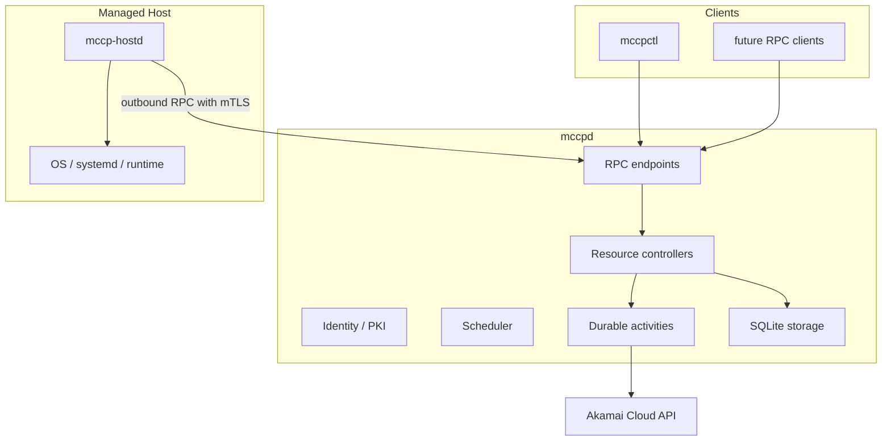

# Architecture

## 1. Purpose

このsystemは、小規模なMinecraft server運用に必要なresourceを、安全かつ予測可能に自動管理します。
利用者や上位layerは、cloud resourceやHost内部の操作手順を直接扱いません。

最初の中期目標はMinecraft lifecycleではなく、Host resource layerを完成させることです。
Host layerが安定した後に、data、workload、server sessionをその上へ追加します。

## 2. Architectural style

`mccpd`はRustで実装するmodular monolithです。一つのprocess、一つのconfiguration、一つのlifecycle、
一つのstate ownerを持ちますが、内部の責務はresourceごとのcontrollerへ分割します。



Processを一つにする理由は、論理componentを混ぜるためではありません。
状態の所有者、transaction boundary、startup/shutdown、configuration、observabilityを一つにするためです。

## 3. Layer decomposition

初期の論理layerは次のとおりです。これはnetwork service境界ではなく、ownership boundaryです。

| Layer | Owns | Does not own |
| --- | --- | --- |
| Interface | RPC client UX、表示、入力 | business rule、DB、provider API |
| Server | 論理serverとsession要求 | Host作成手順、backup engine |
| Workload | Host上で動かすworkload要求 | Host lifecycle、provider ID |
| Data | dataset、snapshot、restore要求 | workload process、Host allocation |
| Host | HostClaim、Host、allocation、retention | Linode APIのwire detail、Minecraft semantics |
| Provider | Linode resourceの作成、観測、削除 | 上位resourceの意味、Host再利用policy |
| Host execution | Hostの観測と限定操作 | global scheduling、provider lifecycle |

初期checkpointではHost、Provider、Host execution、Interface、Identity、Persistenceだけを実装します。

## 4. Dependency rule

上位layerは下位layerのimplementationを直接呼びません。上位layerは要求resourceを作成し、
下位layerはその要求を満たすようにreconcileします。

```text
Server or Workload layer
    creates HostClaim

Host controller
    binds an existing compatible Host
    or requests a provider resource

Provider controller
    creates, observes, and deletes a Linode
```

Provider resource ID、retry、billing、bootstrapはHost subsystemより上へ漏らしません。

## 5. Sources of truth

すべてを一つのdatabase valueへ押し込めません。情報ごとにownerを定めます。

| Information | Source of truth |
| --- | --- |
| resource spec、claim、allocation、controller progress | `mccpd` database |
| Linodeの実在とprovider状態 | Akamai Cloud API |
| Host OSとruntimeの現在状態 | 認証済み`mccp-hostd` observation |
| certificateの発行・失効状態 | `mccpd` identity subsystem |
| 利用者向けsummary | 上記から生成するprojection |

観測値には必ず取得時刻を持たせます。古い観測を現在状態として断定しません。

## 6. Deployment boundary

初期deploymentでは`mccpd`を一台のprivate Control Plane nodeで動かします。
高可用性、複数writer、分散consensusは目標にしません。

それでも、process crash、Host reboot、network interruption、provider API timeoutは通常のfailureとして扱い、
resource重複や誤削除を起こさず再開できる必要があります。

## 7. Non-goals for the foundation

- Python prototypeとの互換性
- multi-cloud対応
- Kubernetesの導入または再実装
- 汎用workflow engineの構築
- Minecraft、Paper、pluginの設定管理
- Host上の任意shell execution API
- 複数Control Plane node
- public multi-tenant service
