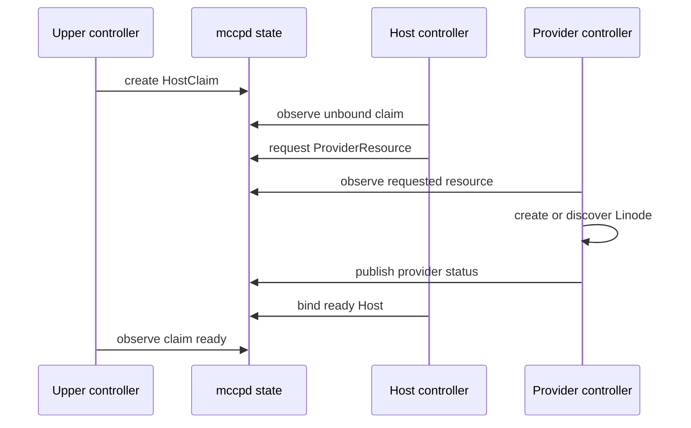

# Controller and claim model

## 1. Reconciliation model

Controllerは保存されたresourceと外部観測を読み、要求状態へ収束するための次の小さなactionを決めます。

```text
observe
compare
plan one action
persist intent
perform action
persist outcome
schedule next reconciliation
```

Controllerはedge-triggered eventだけに依存しません。通知を失っても、database scanやscheduled wakeupで
再び同じ状態を観測し、収束できるlevel-triggered modelを採用します。

## 2. Layer communication

Layer間の通常連携は直接の命令呼び出しではなく、resourceを介します。



一つのprocess内で実装しても、このresource contractを飛び越えて内部関数を呼ばないことを基本とします。
ただし、読み取り専用のquery helperや共通libraryまで機械的に禁止するものではありません。

## 3. Claim semantics

- Claimは上位ownerが存在する間だけ有効。
- Claimは要求を表し、特定のLinode IDを指定しない。
- 初期実装ではHostは一つのactive Claimだけへ排他的に割り当てる。
- compatibleなidle Hostがあれば、新規作成より再利用を優先できる。
- allocation解除後のHost lifecycleはHost controllerが所有する。
- Claimが削除されても、保存すべきdataやworkload cleanupが未完了なら上位controller側のfinalizerで解放を遅延する。

## 4. Controller independence

各controllerは、他controllerが即時に動くことを仮定しません。

- status更新には遅延がある。
- process restartの途中でもdatabase上のresourceだけから再開できる。
- 一時的に矛盾して見える中間状態を許容する。
- 誤った破壊操作より、停止してoperator interventionを要求する方を選ぶ。

## 5. Scheduling

初期実装では一つの`mccpd` process内でcontroller taskを動かします。

- resourceごとに同時reconcileを一つへ直列化する。
- database transaction中にprovider APIやHost RPCを待たない。
- retry時刻を永続化し、長いsleepをworkflow stateとして使わない。
- repeated failureにはbounded exponential backoffとjitterを使用する。
- operator actionが必要なfailureは自動retryを停止する。

## 6. Finalizers

Resource deletionに外部cleanupが必要な場合、finalizer相当の永続状態を持ちます。

例: Host termination

1. active allocationがないことを確認する。
2. Hostをdrainingにする。
3. `mccp-hostd`を通じて再利用不可のcredentialやruntime stateを処理する。
4. provider ownershipを再確認する。
5. Linode削除activityを実行する。
6. provider上の不存在を再観測する。
7. certificateを失効する。
8. Hostをterminatedにする。

途中でprocessが落ちても、完了済みstepを推測せず再観測します。
