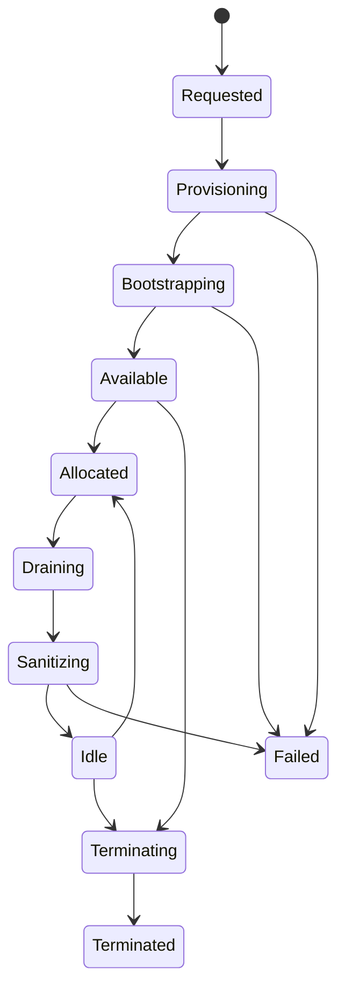

# Host management

## 1. Responsibility

Host subsystemは、上位layerのHost要求を満たすために実行環境を確保し、identity、allocation、health、
idle retention、安全な削除を一貫して管理します。

上位layerは次を知りません。

- Linode ID
- Linode create/delete API
- cloud-init
- billing boundary
- Host certificate
- `mccp-hostd` polling interval
- idle pool

## 2. Lifecycle

初期のHost phaseは次を想定します。

```text
Requested
Provisioning
Bootstrapping
Available
Allocated
Draining
Sanitizing
Idle
Terminating
Terminated
Failed
```

`phase`は大まかな進行を示し、詳細な安全性はconditionで表現します。



## 3. Allocation

初期実装ではHostを排他的に割り当てます。

Allocation可能条件の例:

- HostClassが一致する。
- provider resourceがrunningである。
- bootstrap revisionと`mccp-hostd` revisionが許容範囲内である。
- mTLS identityが有効である。
- observationがfreshである。
- `Healthy=True`である。
- `Reusable=True`または未使用の`Available`である。
- active allocationがない。

適合するidle Hostが複数ある場合のselection policyは、最初はdeterministicで単純にします。

1. 課金済み時間を有効活用できるHost
2. 最も新しいhealthy observationを持つHost
3. 安定したHost ID順

## 4. Release and sanitization

Claim解放後、Hostは即座に再利用可能とはしません。

`mccp-hostd`が限定されたsanitization procedureを実行し、次を確認します。

- active workloadがない。
- temporary credentialが残っていない。
- workload固有のsystemd unitやruntime resourceが残っていない。
- data directoryがpolicyどおり処理されている。
- unexpected mount、process、containerがない。
- Host softwareとsecurity baselineが期待revisionに一致する。

sanitizationの意味は上位workloadの実装とともに拡張します。
初期checkpointではfixture resourceだけを使って再利用境界を検証します。

異なるtrust domain間での再利用は、明示的に安全性を定義するまで許可しません。

## 5. Idle retention

HostClaimがなくなったHostは、policyによりIdleで保持できます。

Akamai Cloudではserviceがaccount上に存在する間は停止中でも課金され、利用時間は時間単位で切り上げられます。
そのため、解放直後の削除が常に最安とは限りません。

RetentionはHost lifecycleへ埋め込まず、policyとして評価します。

```text
HostRetentionPolicy
  mode
  minimum_idle
  maximum_idle
  maximum_idle_hosts
  billing_safety_margin
```

初期mode:

- `immediate`: sanitization後すぐ削除
- `fixed`: 一定時間idle保持
- `billing_aligned`: 次の課金境界より安全margin前まで再利用を待つ

Providerが返すresource作成時刻と現在時刻から課金境界を推定しますが、推定値を課金保証とは扱いません。
削除要求時刻ではなく、provider上の不存在を観測するまでresourceは存在するとみなします。

公式billing reference:
<https://techdocs.akamai.com/cloud-computing/docs/understanding-how-billing-works>

## 6. Provider coupling

Akamai Cloud以外を実装する予定はありません。したがって、架空のmulti-cloud portabilityを目的とした
巨大なprovider abstractionは作りません。

一方で、次の境界は維持します。

- Host domain modelはLinode SDK objectを保持しない。
- provider-specific inputはtyped `LinodeHostSpec`へ閉じ込める。
- create、discover、observe、deleteのfailure分類を共通Activity modelへ変換する。
- provider ownership metadataを必須にする。
- provider adapter以外からLinode APIを呼ばない。

二つ目のproviderが必要になるまで、traitの抽象度を増やしません。

## 7. Safe deletion

削除前には毎回、次を再確認します。

- active HostAllocationがない。
- Hostがdrainingまたはterminatingである。
- ProviderResourceが対象Hostに属する。
- system identity、Host ID、incarnationを表すownership metadataが一致する。
- provider上のresource stateが観測できる。

delete APIのresponseが不明な場合は、再度無条件にdeleteせず、まずresourceを再発見します。
不存在を確認するまでHostをterminatedにしません。
