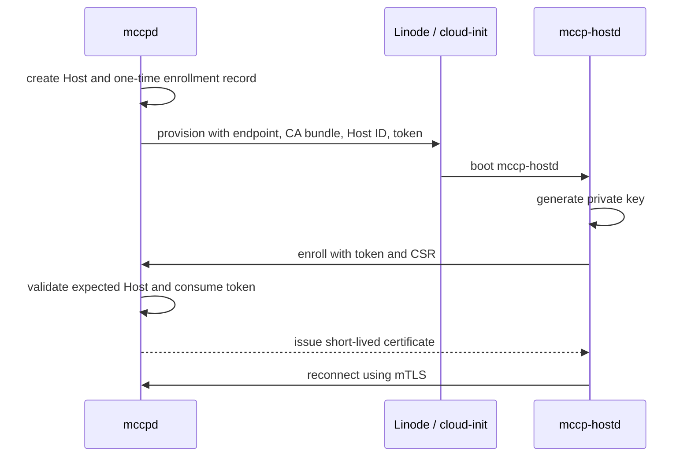

# Identity and PKI

## 1. Goals

- `mccpd`と`mccp-hostd`を相互認証する。
- Host identityをprovider IPやLinode IDだけに依存させない。
- Host private keyをHost外へ出さない。
- bootstrap credentialを短命かつ一回限りにする。
- certificate rotationとrevocationを通常operationとして扱う。
- 古いHostや複製されたcredentialによる操作をfencingする。

## 2. Trust hierarchy

推奨する構成:

```text
Offline root CA
    └── online intermediate CA used by mccpd
            ├── mccpd server certificates
            └── mccp-hostd client certificates
```

`mccpd` processがroot CA private keyを直接保持しない設計を目標とします。
開発環境では簡略化しても、rootとintermediateの役割は概念上分離します。

TLS 1.3とcertificate-based client authenticationを前提候補とします。

Reference: <https://www.rfc-editor.org/rfc/rfc8446>

## 3. Host identity

Host certificateは、少なくとも次へbindingします。

- Host ID
- Host incarnation
- trust domain
- certificate serial
- validity period

Identityはcertificateのdisplay nameではなく、URI SANなどのmachine-readable fieldから取得します。
例として`urn:mccp:host:<host-id>:<incarnation>`を検討します。

独自実装をSPIFFE準拠と誤認させないため、SPIFFEを実装しない限り`spiffe://` schemeは使いません。

## 4. Enrollment



Enrollment tokenは:

- 一回限り
- 短い期限
- 特定Host IDとincarnationへ限定
- databaseには可能ならhashだけを保存
- 使用後に無効化
- logへ出さない

とします。

## 5. Authorization

TLS client certificateが有効でも、それだけで全Host RPCを許可しません。
各requestで次を照合します。

- certificate identity
- requestが示すHost ID
- database上のcurrent incarnation
- current allocation generation
- RPC method scope
- certificate revocation state

Host certificateはoperator RPCを呼べません。Operator credentialはHost RPCを呼べません。

## 6. Rotation and revocation

- leaf certificateは短命にする。
- 更新は有効なmTLS connection上で行う。
- current incarnationが変わったHost certificateは拒否する。
- Host termination時にcertificateを失効する。
- CA rotationではtrust bundleのoverlap期間を持つ。
- Control Plane clockとHost clockのskewを観測し、期限判定errorを説明できるようにする。

具体的なcertificate lifetime、revocation mechanism、key algorithm、Rust libraryはopen questionです。
