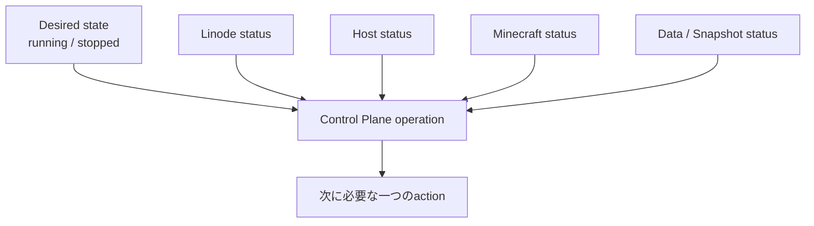
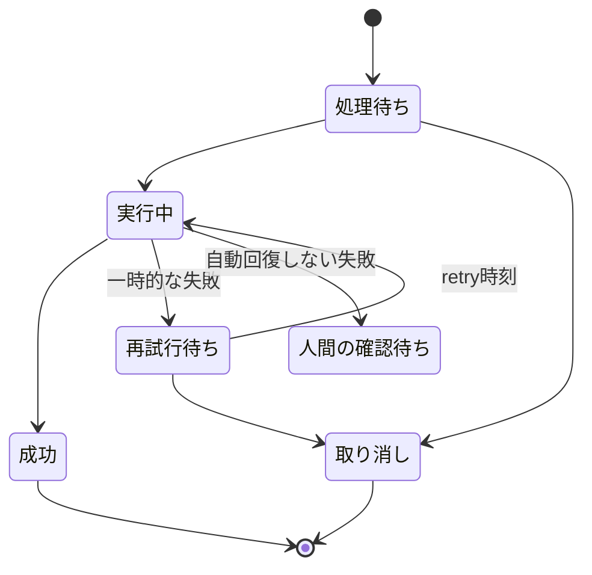
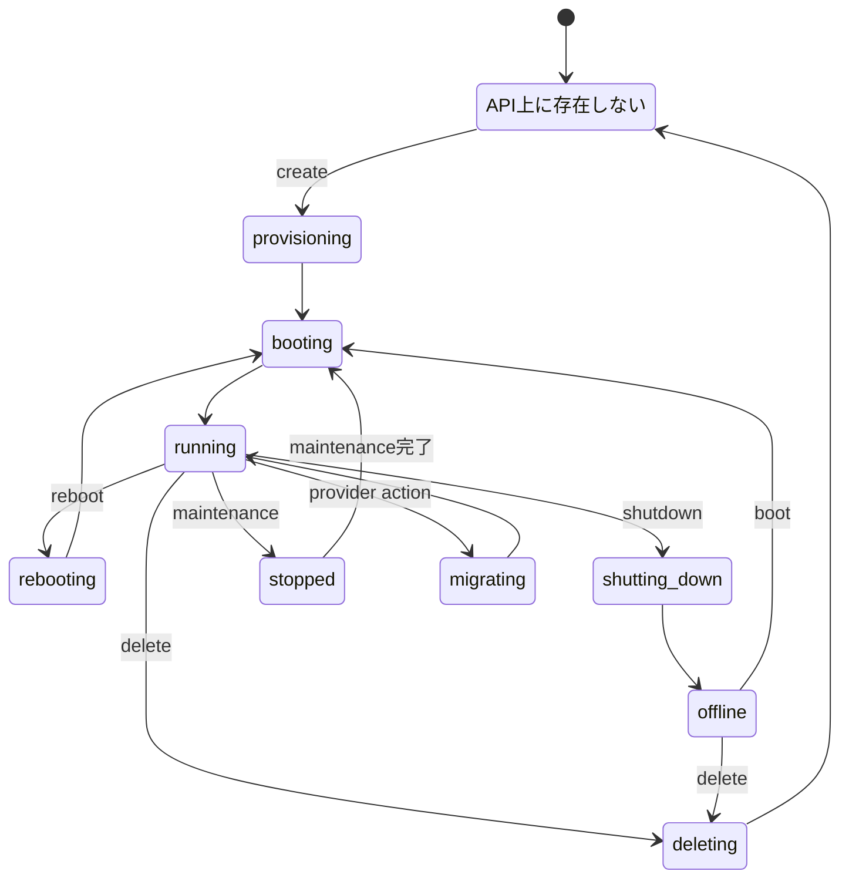
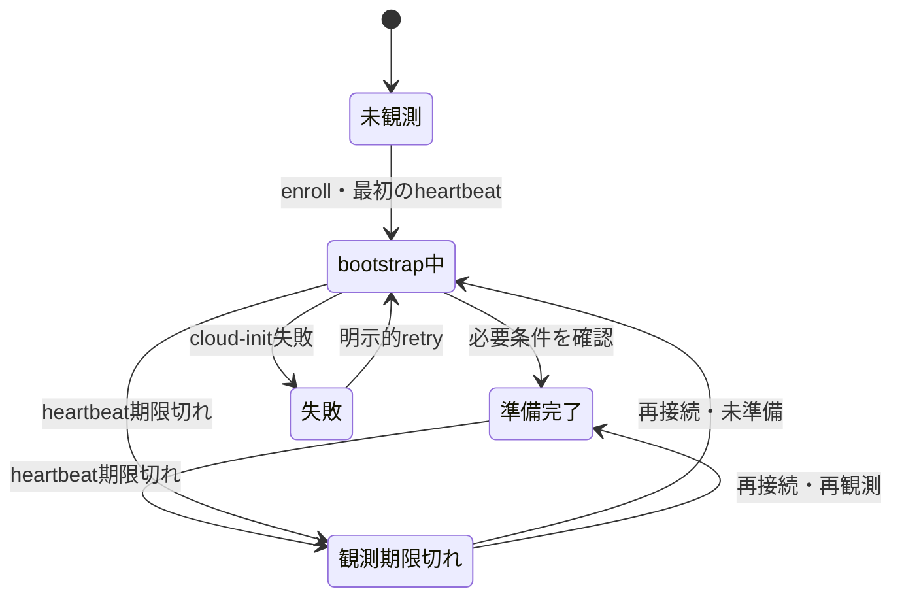
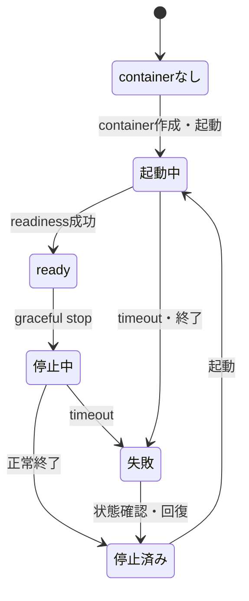
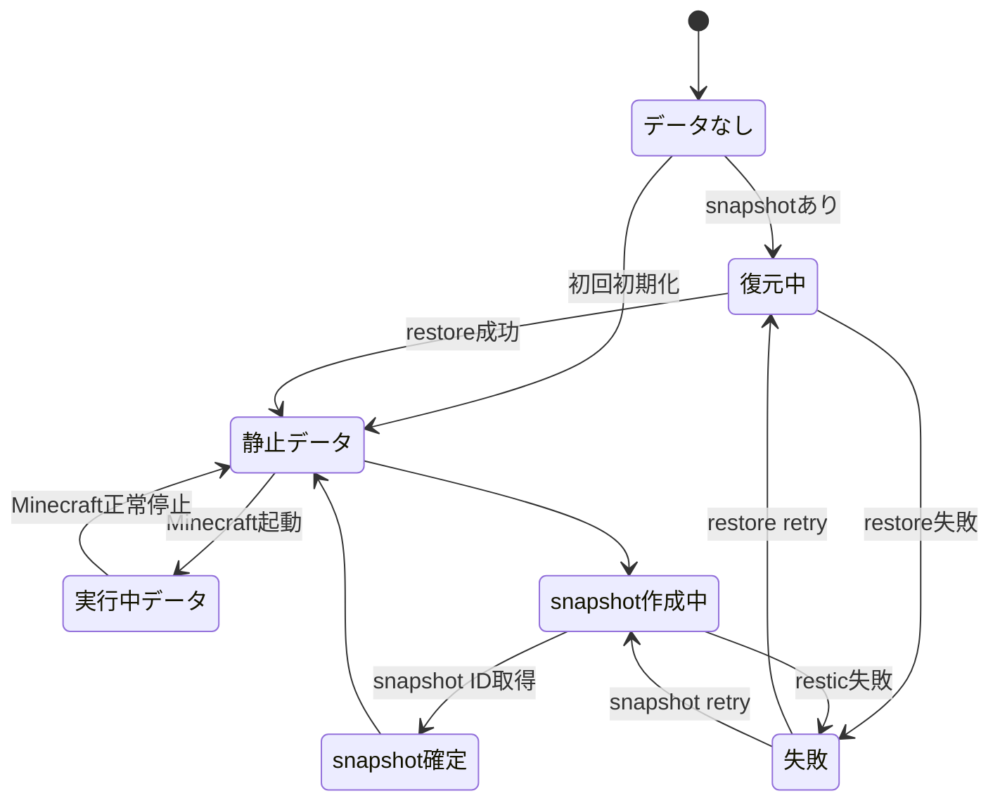
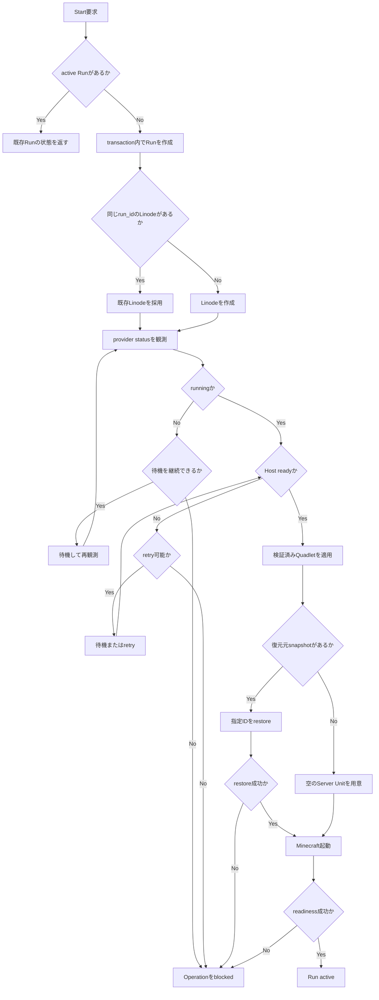
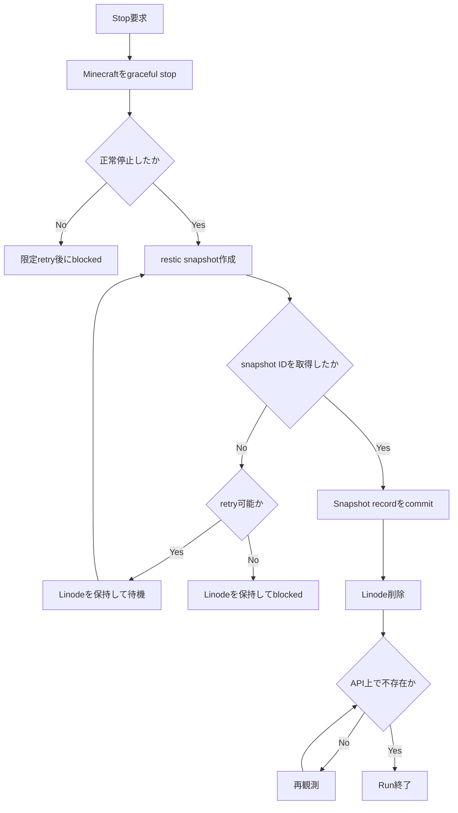
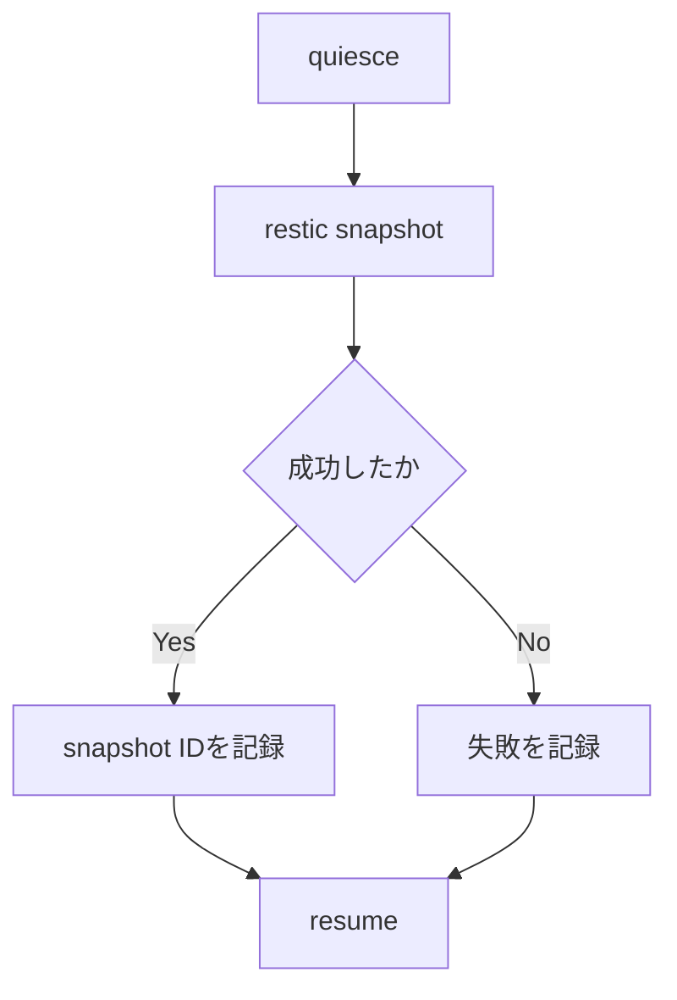

# State machines

## 1. 原則

このシステムには複数レイヤーの状態機械があります。
Control Planeは、それらを一つの巨大なenumへ変換せず、
各レイヤーの観測結果を独立して保存します。



外部へ表示する`starting`、`running`、`stopping`などは、これらから導出するprojectionです。projectionを正本として永続化しません。

## 2. Control Plane operation



API timeoutは直ちに失敗とはみなしません。GET/listによる再観測を行い、actionが実際には成功していたか確認します。

## 3. Linode provider status

### 3.1 正式な値

Linode API OpenAPI specificationで定義されている`status`は次の14種類です。

| API value | Control Planeでの扱い |
| --- | --- |
| `running` | VMが稼働している。HostやMinecraftがreadyとは限らない。 |
| `offline` | 通常の電源OFF状態。 |
| `booting` | 起動処理中。 |
| `busy` | placement groupへの割り当てを完了するためboot中。現在の構成では通常期待しない。 |
| `rebooting` | reboot中。 |
| `shutting_down` | shutdown中。 |
| `provisioning` | OSまたはMarketplace applicationの適用中。 |
| `deleting` | 削除中。 |
| `migrating` | provider内でmigration中。Control Planeは完了を待つ。 |
| `rebuilding` | rebuild中。通常のworkflowでは使用しない。 |
| `cloning` | clone中。通常のworkflowでは使用しない。 |
| `restoring` | providerのbackup restore中。通常のworkflowでは使用しない。 |
| `stopped` | maintenanceなどによりprovider側で停止された状態。`offline`と区別する。 |
| `billing_suspension` | 支払い状態により停止。自動回復せず`blocked`にする。 |

正本は
[AkamaiのLinode API OpenAPI specification](https://github.com/linode/linode-api-openapi)
です。Python SDKの`Instance.status`はvolatileな文字列プロパティとして公開されるため、
実装時には未知の将来値も保持できるようにします。

実装上は`running`、`stopped`、`pending`、`deleting`、`blocked`、`unknown`へ正規化しますが、
DBにはAPIのraw valueも残します。mappingの判断は
[ADR-0006](decisions/0006-use-official-linode-sdk.md)に記録しています。

### 3.2 通常使用する遷移

OpenAPIは取り得る値を定義しますが、完全な遷移グラフまでは保証しません。次はこのControl Planeが通常観測すると想定する遷移です。



`ABSENT`はLinode APIのstatusではなく、対象IDまたはタグに対応するリソースが存在しないというControl Planeの観測結果です。

### 3.3 観測不能の表現

API timeoutやnetwork errorを`unknown`というLinode statusへ変換しません。最低限、次を別フィールドとして持ちます。

```text
provider_status: string | null
provider_status_observed_at: datetime | null
provider_observation_error: string | null
```

APIが新しいstatusを追加してもraw valueを失わず、未知の値では破壊的actionを行わずに再観測または`blocked`へ移行します。

## 4. Host state

Host stateはLinodeのstatusとは独立しています。Linodeが`running`でもcloud-init、agent enrollment、
Podmanの準備が完了していない場合があります。Host agentはControl Planeへoutbound pollingし、
Control Planeは認証済みheartbeatの有無とreadinessを別に保持します。

```text
last_heartbeat_at: datetime | null
connectivity: never_seen | current | stale
readiness: bootstrapping | ready | failed
agent_version: string | null
protocol_version: string | null
last_error_code: string | null
```

`stale`はHostが失敗したという断定ではなく、設定した時間内に観測できなかったことを表します。
利用者向けの`unreachable`はconnectivityから導出します。



Host protocolの`connected`は互換versionのagentから認証済みpollを受けた状態だけを表し、Hostの
`ready`とは区別します。Gate 2ではDebian 13、Python、Podman、restic、Quadlet generator、agent
serviceをcapabilityとservice observationから検証します。運用Runの`ready`にはdata directoryや
workload artifactなど後続Gateの条件も加えます。agent/protocol versionが非互換なら`ready`にせず
Operationを`blocked`にします。具体的な境界は
[ADR-0008](decisions/0008-use-outbound-host-agent.md)と
[ADR-0010](decisions/0010-use-versioned-host-protocol.md)を参照してください。

## 5. Minecraft workload state



Paperやpluginの設定内容は扱いません。ただし正常停止、readiness、将来のsnapshot用quiesceはworkload lifecycleとしてこの境界に含めます。

## 6. Data and snapshot state



`clean`はMinecraft processがdata directoryを書き換えていないことを表します。resticのrepository integrity全体を表すものではありません。

## 7. Start workflow



## 8. Stop workflow



新しいsnapshotの作成に失敗した状態でLinodeを削除しません。限定回数のretryで解決しなければ、手動確認が可能な`blocked`へ移行します。

## 9. 実行中の手動snapshot

Gate 5では、任意のタイミングで呼べる安全な手動snapshot primitiveを実装します。scheduleを持つ
定期snapshotは、間隔、失敗表示、retentionとの関係が未確定なため別の後続計画とします。

実行中ファイルを無条件に読むのではなく、Host agentの一つの固定command内でRCON `save-off`、
`save-all flush`、container pauseを行ってからresticを実行します。成功・失敗のどちらでもunpauseと
`save-on`を試みます。



agentがpause中に中断した場合、at-least-onceで同じcommandを再実行する前にunpauseと`save-on`を
行います。snapshot失敗時はMinecraftを停止せず、最後にcommit済みのsnapshotを復旧点として維持します。

## 10. 利用者向け表示状態

表示状態は次の優先順位で導出します。これは説明用の初期規則で、実装時には純粋関数としてtestします。

| 条件 | 表示 |
| --- | --- |
| operationが`blocked` | `needs_attention` |
| desired stateが`stopped`でstop処理中 | `stopping` |
| desired stateが`running`でMinecraftが`ready` | `running` |
| desired stateが`running`でそれ以外 | `starting` |
| active Runなし | `stopped` |
| providerを観測できず確定不能 | `unknown` |

ここで`unknown`は利用者向け表示であり、Linode APIの`status`値ではありません。
